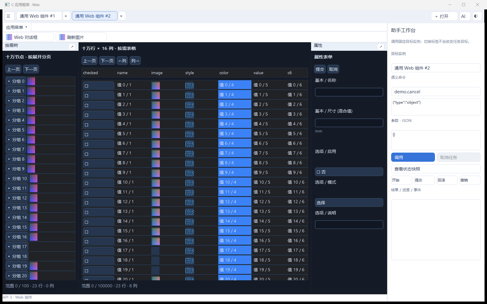

# SDK 0.3 / API3 验收记录

日期：2026-10-03。实现基准：`3375459ca2d85d0627e3072e3f1e83fc4fa84aae`。目标 Windows x64、C11、SDK0.3.0开发版/API3/标准3；未创建稳定标签。本记录不将接口声明、模拟消息或程序设置 DPI 当成完整真实交互验收。

## 1. 构建与自动化

环境为 Windows x64、MSVC Build Tools 18、Windows SDK、CMake/Ninja、Release。Lexbor/QuickJS-NG沿用固定 commit，依赖 checkout 无源码修改。完整配置开启轻量后端及可选 WebView2：**27通过、0失败、1跳过，共28项**。WebView2测试在允许浏览器子进程的执行环境运行；受限环境内创建超时不作为后端通过证据。

| 测试类别 | 结果和证据 |
| --- | --- |
| 包/API/ABI、C11/C++头文件 | package_format、application_versions、public_headers通过，拒绝API4/声明不一致 |
| 无窗口组件合同 | components_core通过：描述复制、范围、增删、实例隔离、换源及非法数据 |
| 图片/WIC/GDI | images_windows通过：非预乘RGBA输入、透明合成、跨实例拒绝、损坏PNG、预算及LRU压力 |
| 原生无代理编辑 | web_text_edit通过：Unicode/grapheme、剪贴板、撤销/重做、只读、多行、焦点/DPI；FindWindowEx没有EDIT |
| 实际通用宿主 | generic_web_host通过：真实模板/JS、应用DLL、后台线程、双实例、表格/树、字段错误/提交、模态、图片与关闭重开 |
| 旧外壳/内容/生命周期 | workspace_integration、web_host_frontend、web_shell_slots、native_activation、surface_input及助手回归通过 |
| OpenGL/尺寸/DPI | opengl_integration、responsive_layout、dpi_integration、floating_web_dpi、native_responsive通过 |
| 可选WebView2 | parity/messages原有两项通过；没有据此声称新增组件能力等价 |
| 物理跨显示器 | monitor_transition跳过，当前没有所需不同DPI多屏条件 |

干净源码副本排除 build/、.deps/ 和本地工作记录：原生无依赖配置构建通过，**17通过、1跳过，共18项**。该配置关闭独立宿主/轻量/WebView2，不承诺显示新组件。默认轻量配置从干净副本、通过外部固定依赖目录构建并测试，25通过、1跳过，共26项。

可复现命令见[构建说明](../build-and-validation.md)。完整可选验收需要准备固定WebView2 SDK/Runtime并启用其开关。普通clone默认不含WebView2两项，因此默认测试数为26。

## 2. 实际宿主与大数据

测试直接使用真实宿主源码、轻量HTML/JS、C组件和动态加载的DLL，运行消息循环及后台投递；不是只调用无窗口接口。

| 场景 | 实测 |
| --- | --- |
| 初始100000行×16列 | 实际DOM170，当前17行、5列 |
| 第99900行附近，末4列 | 实际DOM76，查询12行，不生成100000行DOM |
| 100个树分支全部展开 | 总100100节点，实际DOM78，缓存1800行 |
| 图片预算 | 测试后558680字节，小于33554432上限；压力测试另验证100次创建的LRU淘汰 |
| 图片同ID更新 | DOM数与累计行节点创建数均保持；只更新对应图片 |
| 过期结果 | 内容版本改变及项目删除后，旧图片结果CANCELLED |
| 文本与字段 | 未提交中文字符串跨标签保留；负尺寸显示应用校验错误，正值实际点击提交成功 |
| 单次命令 | 树叶点击只调用一次选择命令，不同时再由click重复提交 |
| 实例模态 | 只禁用目标容器，另一个实例仍启用；切换/关闭保留或恢复；Web节点菜单实际点击可打开对话框 |
| UI控件审计 | 新宿主/示例进程子窗口无Edit/Button/TreeView/ListView/ComboBox；旧应用随后加载，单独识别兼容例外 |
| 内容槽 | OpenGL窗口和context保留；最小化/恢复后make_current、像素矩形与swap通过 |

四种窗口尺寸1920×1080、1280×720、800×600、640×480与96/144/192程序DPI组合通过，DOM预算保持；这属于程序布局测试，**不证明真实跨屏移动**。数据缓存2MiB、图片/资源/索引32MiB、新投递8MiB分别管理；这些是框架持有/排队预算，不包含应用自身业务数据或WIC/解码临时内存。

## 3. 旧包与卸载

除了冻结 SDK1/2 头文件构建的可重复调用方，还实际加载升级前保存的原包，与两个新组件实例混合运行：

| 原包 | SHA256 |
| --- | --- |
| 原API1 EDA | `86988546516e17b4783c5a9ed1583dfaa9e73ecdfcd1f5b8fad9a4910a5a3503` |
| 升级前API2 Counter | `2cf7a9619365184211cb636db6537c6119f03bc40d41d92edfbe6c235d3ccb2f` |

本地保留原包/运行库，不上传构建产物。原包混合加载与关闭测试0失败。workspace回归另外覆盖create/mount失败、拒绝/等待关闭、嵌套回调寿命、实际DLL卸载及临时目录删除；新例停止并join线程后卸载，重开实例ID不复用，旧结果不能送入新实例。

历史版本/EDIT/class/193节点断言源保存于[api2_baseline](../../tests/api2_baseline/README.md)，新测试按公开API3合同替换。其他原回归继续执行，不删除历史失败记录。

## 4. 截图与未验证条件

下图为重新启动真实独立宿主、加载两个API3示例后的1600×1000窗口截图；图标、图片、样式、表格和属性提交入口实际可见。只捕获本项目窗口，完成后正常关闭。浮动OpenGL内容为另一独立窗口，不在这个根窗口截图中；其上下文运行由集成测试验证。

### 4.1 未验证项目与补验清单

以下状态截至2026-10-03，代码验收基准为 `f8eb3504f4682720967d631e53c985530343a2e0`。只有 UV-02 是 CTest 明确跳过的项目；其余是尚未完成的人工验收。缺少实操证据不记为通过，也不直接判定为实现失败。

| 编号 | 项目与当前状态 | 已有证据及其边界 | 复验条件、步骤和通过要求 |
| --- | --- | --- | --- |
| UV-01 | 实际中文输入法：未验证 | Unicode、程序中文输入、剪贴板、编辑和焦点自动测试通过；没有真实输入法组合/候选操作记录 | 在真实Windows中文输入法下测试单行、多行和表格编辑：组合、候选位置、提交、取消，组合中Enter/Esc、切换焦点/标签及DPI。文本不重复、不丢失，候选跟随光标，编辑键与业务命令不重复触发；记录输入法名称/版本及截图或录像 |
| UV-02 | 不同DPI物理显示器移动：`ui_monitor_transition`跳过，未验证 | 当前只有一个显示器；四种窗口尺寸与96/144/192程序DPI布局通过，不能证明实际跨屏处理 | 准备至少两台不同缩放比例显示器，拖动真实宿主往返，记录 `WM_DPICHANGED`、窗口/组件矩形、DPI和OpenGL framebuffer；布局、候选位置和绘图正常，最小化恢复及标签切换后仍正常 |
| UV-03 | 长期人工滚动与资源压力：未验证 | 十万数据虚拟化、图片LRU、超限、过期结果及关闭回收自动测试通过；未进行长时间连续实操 | 连续滚动行/列、展开树、刷新缩略图、切换两实例并关闭重开，记录测试时长、DOM数、缓存/队列统计和进程内存曲线；DOM和受管资源保持预算，界面无持续增长或失响应，关闭后实例资源回收。进程总内存包含引擎/应用，不能直接等同32MiB图片预算 |
| UV-04 | 完整编辑手势与复杂布局组合：部分自动验证，人工未验证 | 常规草稿、焦点、选择、增量图片、模态和标签切换通过；未逐项人工覆盖所有组合 | 在编辑草稿和选择文本时执行停靠/浮动、窄窗折叠、展开/折叠、滚动、DPI变化及对话框开关，验证仍有效的项目保留展开、选择、焦点和未提交输入；被删除项目正确失效，Enter/Esc/默认按钮和焦点恢复正确 |

补验时逐项追加日期、框架和应用commit、机器/显示器/输入法条件、复现步骤、观察结果及证据；发现缺陷记录复现和修复后的复验，不覆盖本轮未验证记录。应用自己的验收应引用这些边界，不能继承一个不存在的“全功能通过”结论。

程序输入中文、WM_CHAR、模拟IME或设DPI都不能替代以上实操。尚未实现的功能单独列在下面，不归入待补验项。

**部分支持**：固定行高/按需窗口而非任意浏览器表格；普通文本而非富文本；枚举循环按钮、文本颜色值而非完整选择器；缓存外更新需应用更新数据源后查询。复杂编辑/布局组合的人工验收见 UV-04。

**未实现**：WebView2新增C图片ID/框架组件呈现、完整浏览器、Canvas/SVG、富文本、可变行高、拖拽停靠树、布局持久化。能力合同见[通用Web UI](../generic-web-ui.md)，不能把基础HTML或接口成功当作这些功能已交付。
