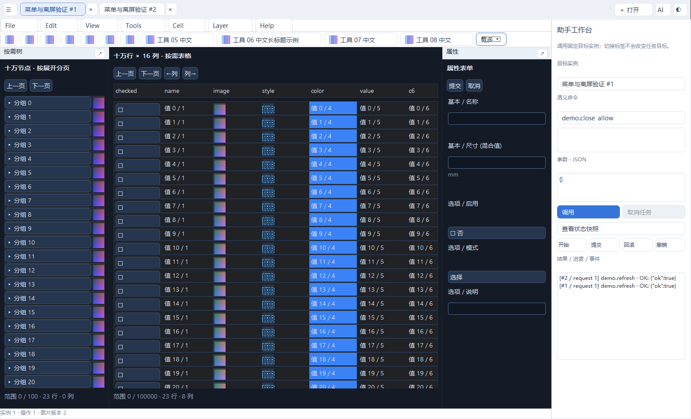

# SDK0.4 / API4 验收记录

日期：2026-10-04。审查/实施起点074a70fa5d2e04dde3b872a76641571c158db7e6，目标Windows x64/C11、SDK0.4.0开发版/API4/标准4。最终源码以仓库提交为准，无新稳定标签。未修改请求方应用或PERF-001。

## 1. 能力交付范围

| 请求 | 当前状态 | 实现与边界 |
| --- | --- | --- |
| FW-01 分组菜单 | 已实现；访问键未实现 | 七组常驻、/嵌套、group顺序、固定实例、键盘与窄窗更多，应用Ctrl+O/宿主Ctrl+Shift+O分流 |
| FW-02 公共菜单 | 已实现；物理多屏边缘人工未验证 | HOST/SLOT/ROW锚点、独立Web窗口、work area翻转夹紧、128项单层预算及分页、状态/锚点失效；32项末项通过真实输入 |
| FW-04 TREE/工具 | 已实现；复杂组合人工未验证 | TREE剩余宽度/无空图占位、公共完整标题提示、COMPACT、toolbar分组与可达溢出；230px的TOP/CHILD验证 |
| FW-03 真实Web离屏 | 已实现于轻量后端；Session0未验证 | 正常HTML/JS/模板、公共输入/呈现/捕获/flush，无HWND；WebView2新增诊断未实现 |
| FW-05 workspace离屏 | 已实现显式Web路径；请求方应用未适配验证 | 原包加载/DLL/资源/队列/生命周期，双实例、真实FORM/DIALOG/右键菜单/大表格、REFUSE/WAIT、失败清理、卸载重开，线程窗口数0 |
| FW-06 GL离屏 | 第一阶段部分支持 | 实际>=3.3 compatibility、隐藏WGL/DC、私有FBO、纹理/固定管线、frame/input/readback和双context；真正无窗口/无登录环境未实现或未验证，离屏MSAA不支持 |

接口合同见[菜单与离屏](../framework-menu-offscreen.md)，迁移见[0.3 → 0.4](../migration-v0.3-to-v0.4.md)。UI业务区域不采用原生业务控件；保留原API1/2/3兼容路径和系统选择器例外。框架不自动让已有窗口应用获得完整无头能力。

## 2. 可复现构建与自动测试

Windows x64、MSVC Build Tools18、Windows SDK、CMake/Ninja、Release，Segoe UI字体；轻量依赖固定commit沿用README。完整开启轻量与可选WebView2的构建通过。33项中32通过、1跳过；包含一个可选的原API3包基线测试。默认clone没有原二进制基线，开启WebView2时为32项，关闭WebView2为30项；不把缺少本地原包算成旧包已复验。

首次受限环境中WebView2两项创建超时保留为执行失败记录；在允许浏览器子进程的环境复验，两项通过。物理跨屏ui_monitor_transition仍跳过。原生不含轻量/WebView2配置构建通过，18项中17通过、1跳过。另从144个源码/资源/文档文件的干净导出构建相同原生配置；未复制.git、.deps或构建产物，18项仍为17通过、1跨屏跳过。

```powershell
cmake -S . -B build/web-shell -G Ninja -DCMAKE_BUILD_TYPE=Release
cmake --build build/web-shell
ctest --test-dir build/web-shell --output-on-failure
ctest --test-dir build/web-shell -R 'ui_(framework_features_host|menu_offscreen|workspace_offscreen|offscreen_gl)' --output-on-failure
```

可选原包复验：UI_LEGACY_COMPONENT_PACKAGE指定升级前generic_components.uapp，UI_LEGACY_EDA_PACKAGE指定原API1 EDA；不是重新打包当前样例。依赖准备、WebView2开关和无依赖原生配置见[构建说明](../build-and-validation.md)。

| 测试 | 证据 |
| --- | --- |
| ui_menu_offscreen | 真正NULL parent引擎/模板，32菜单末项实际点击、禁用/Esc、双host、行删除失效；TREE在230px可读，真实FORM中文草稿及STATUS模板；RGBA尺寸345×360/alpha255和溢出验证；线程HWND=0 |
| ui_framework_features_host | 实际宿主/应用DLL七组可见、语义命令一次、切换关闭旧菜单、Ctrl+O一次、四尺寸与96/144/192程序DPI、15工具及最后新增工具可达；本项目客户区截图 |
| ui_workspace_offscreen | 共享运行库真实加载两实例，内容槽无native handle；FORM焦点/草稿、DIALOG提交/模态、100000行16列按需查询到末部，实际DOM75/缓存12行/4列；真实右键经过正常JS/命令打开公共节点菜单；复制worker事件、有界flush、REFUSE/WAIT、create/mount失败、关闭后DLL卸载及重开、旧ID事件丢弃，HWND=0 |
| ui_offscreen_gl | 当前实际驱动>=3.3 compatibility，纹理上传、固定管线、已有frame及input、顶向下RGBA验证、双context/viewport恢复、DPI resize、core和超预算拒绝、应用修改PACK_SKIP/PBO后的安全读回及状态恢复、无可见窗口 |
| C11/C++、旧回归 | 公共头文件、包/API一致性、注册/图片/文本、正常workspace/内容槽/助手/布局及旧原生样例回归通过 |
| API1/2/3原包 | 原API1/2/3未重新构建的二进制包另运行实际宿主双API3实例/图片/编辑/旧包混合用例，0失败；冻结SDK1/2/3重新构建用例单独保留 |

原API3包SHA256：d024c191b6fcae0da5eecc71b29c3429e27a74db9ec339a118a9577c691c0745。冻结SDK3文件逐一与起点提交核对；历史变更前断言保留于tests/api3_baseline，未知API拒绝值由4改为5，菜单输入断言改用公共入口。

实际离屏驱动返回vendor `Intel`、renderer `Intel(R) UHD Graphics 770`、version `3.3.0 - Build 32.0.101.7079`、compatibility profile；硬件/软件类别未判定。新补测的公共右键及像素打包/PBO状态使用相同模板和frame路径，不以直接handler或软件替代图像作为证据。

## 3. 真实界面

下面是1600×1000宿主的实际客户区捕获，可见七个菜单分组、工具分组/更多、两个实例、树表格/表单及助手。浮动GL内容不在根客户区内，其绘制由正常与离屏测试分别验证。没有把截图当作物理输入法、跨屏或桌面交换证据。



## 4. 未验证与未实现

原[API3 UV-01..04](api3-validation.md#41-未验证项目与补验清单)继续有效，不以新增离屏测试抵消：实际中文IME、不同DPI物理跨屏、长期人工滚动/资源压力、复杂编辑/停靠/浮动/DPI组合仍需人工补验。

| 编号 | 未验证项目 | 原因与补验方法 |
| --- | --- | --- |
| UV-05 | Session0/无登录CI/远程驱动 | 当前在已登录Windows会话运行。无HWND Web与隐藏WGL分别在目标CI/远程环境运行，记录字体、会话、GPU和错误；隐藏WGL失败不能用软件图像替代实际GL |
| UV-06 | 请求方应用完整离屏业务接入 | 本轮只验证通用C示例，未修改请求方应用；由应用按公共接口适配文件路径、timer/IME/wake及renderer，验证业务像素、编辑事务和生命周期 |
| UV-07 | 不同DPI物理多屏边缘菜单、真实桌面遮挡/合成 | 自动化验证程序布局与当前屏幕弹窗；仍需在真实不同缩放显示器边缘打开HOST/SLOT/ROW菜单，检查翻转、外部点击、焦点恢复和GL遮挡，并记录截图/操作 |

未实现：Alt访问键、真正不依赖窗口的GL上下文、离屏MSAA、WebView2新增呈现/捕获和框架组件桥接。原计划明确排除的完整浏览器/Canvas/SVG/富文本/可变行高/拖拽停靠/布局持久化继续不提供。

补验追加日期、commit、环境、步骤、观察及证据；不把模拟消息、程序中文或设置DPI记成真实操作通过，不把未验证直接判断为实现失败。
