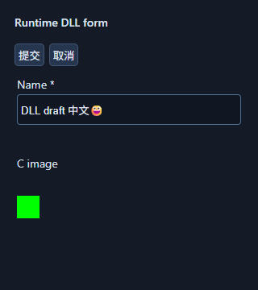

# SDK0.5 / API5 验收记录

日期：2026-10-04。起点为干净的 `codex/menus-offscreen`、HEAD `1f77b2ef278f41f0723fa40b0125135b16f49949`，与当时远程 main/工作分支一致。产品提交：`87478fa20d7bb46809c0ef81dd44f972dc193a24`。SDK0.5.0开发版、API5、标准修订5；ABI1、入口 `ui_app_query_v1`、包格式1不变，未创建稳定标签。没有修改请求方应用、PERF-001、SDK1/2/3冻结头文件或原包，没有使用 graph-engineering、子代理或新会话。

四项均已实现并通过本机实际路径；**全阶段验收尚未完成**。Session0/无登录CI、真实IME、物理跨屏及长期人工压力仍缺少条件，不能由本记录的通过结果代替。

## 1. 实施设计与成功标准

先核对API3/API4历史记录、公共结构完整前缀与实际实现，再按公共ABI → 菜单输入 → 无窗口提供方/MSAA → Runtime桥接 → 集成与旧包顺序实施。没有把UNSUPPORTED、接口占位或编译成功当成新能力验收。

| 功能 | 设计、依赖与兼容策略 | 本机成功标准与结果 |
| --- | --- | --- |
| 菜单Alt访问键 | size判断的ASCII助记键；复用原菜单/命令，原生消息先于TranslateMessage，保留编辑/IME/AltGr及既有快捷键路由 | 裸Alt、嵌套/方向键、Enter/Esc、重复键循环、禁用、窄窗分页末项、实例/模态门控通过；实际WebView2焦点下Alt+F/S只触发一次，Esc恢复原Chrome焦点，Ctrl+O只触发原应用命令一次 |
| 真正无窗口GL | 显式固定OSMesa内存上下文；应用经surface解析GL函数，原隐藏WGL入口保持原模式 | 实际Mesa context及应用DLL frame输出、NO_WINDOW、native_handle=NULL；当前线程CBT记录创建HWND=0，进程窗口数=0；resize/input、双context状态和16次回收通过 |
| 离屏MSAA | 精确采样数、多采样RGBA8/depth24-stencil8附件、blit resolve、RGBA读回；保留旧隐藏WGL非MSAA预算 | WGL和OSMesa实际附件samples=4、119个抗锯齿中间值像素，非MSAA为0个；9999 samples明确失败，预算拒绝保留旧尺寸，frame遗留scissor仍完整resolve；状态/销毁/旧2048×2048边界通过 |
| WebView2补齐 | 实际SDK/Runtime异步查询、CapturePreview/WIC RGBA、C图片资源请求、借用后端接共同模板；旧配置保持native_handle=NULL | 真实Runtime及动态应用DLL的FORM/TREE/DIALOG、图片更新/释放、编辑、语义命令、双实例、模态、旧结果失效和关闭通过；32次DLL卸载重开及提前关闭压力通过 |

接口、预算和线程/所有权合同见[菜单/离屏](../framework-menu-offscreen.md#6-api5-菜单无窗口-gl-与-msaa-合同)、[共同组件](../generic-web-ui.md#api5-webview2-与共同组件)、[迁移](../migration-v0.4-to-v0.5.md)。

## 2. 环境、依赖与真实输出

Windows x64普通账户、已登录Session1、单显示器；MSVC19.50.35727、Windows SDK10.0.26100、C11 Release、CMake/Ninja。框架DLL和新增验收调用方使用 `/W4 /WX /utf-8`；公共C11/C++头文件调用方通过。目标CI不是本机环境。

| 路径 | 实际环境/依赖 | 证据边界 |
| --- | --- | --- |
| 隐藏WGL | Intel / Intel(R) UHD Graphics 770 / `3.3.0 - Build 32.0.101.7079` | 实际GL输出，HIDDEN_WINDOW；含bootstrap、两个context及兼容边界测试，共记录9次HWND创建，销毁后进程窗口数0 |
| 无窗口GL | Mesa / llvmpipe (LLVM19.1.7,256bits) / `4.5 (Compatibility Profile) Mesa 24.3.4 (git-1950a8b78c)` | 真实软件桌面GL context运行应用frame，未使用替代图片；不声称GPU加速。16次重开句柄209→209，模块仍驻留 |
| WebView2 | SDK1.0.4129.50，实际Runtime154.0.4258.53 | Runtime版本由SDK直接查询；实际网页/应用DLL执行与CapturePreview，不以轻量后端通过替代 |
| 轻量 | README固定Lexbor/QuickJS-NG依赖 | 原无HWND模板、编辑、菜单、队列/生命周期回归继续通过 |

OSMesa固定包为 [mesa-dist-win 24.3.4 MSVC x64](https://github.com/pal1000/mesa-dist-win/releases/tag/24.3.4)，归档SHA256 `7ebc711ad1896ac88ab21e142f1017f8ff035f0f342bdb72fbb5e2eb881ba363`。最初检查26.2.3包未找到OSMesa；上游[25.1发布说明](https://docs.mesa3d.org/relnotes/25.1.0.html)记录移除OSMesa，不能把新版包当成可用依赖。Windows EGL/WGL不能自动推断无HWND/DC，本轮采用可实测的旧OSMesa提供方，没有实现硬件EGL。

OSMesa screen/worker及模块缓存是进程级；最后surface销毁释放context、FBO与框架引用，不强制卸载仍有提供方缓存的DLL。句柄稳定和context回收不等于DLL已卸载，也不等于该旧依赖仍受上游维护。分发需保留该提供方及相邻依赖、运行库和许可。

以下PNG从测试的真实PPM像素直接转换，未重绘或合成；GL为64×64，FORM为320×360。GL程序调用实际frame、resolve、ReadPixels；FORM来自实际Runtime CapturePreview，不是桌面截图，也不包含GL或IME候选窗口。




## 3. 可复验步骤与最终检查

在x64 Visual Studio开发终端按[构建说明](../build-and-validation.md#api5-可选提供方与复验)准备固定依赖。保全原包后可执行：

```powershell
$provider = (Resolve-Path .deps/mesa-24.3.4/x64/osmesa.dll).Path
cmake -S . -B build/api5 -G Ninja -DCMAKE_BUILD_TYPE=Release -DUI_FRAMEWORK_ENABLE_WEBVIEW2=ON "-DUI_OSMESA_LIBRARY=$provider" "-DUI_LEGACY_EDA_PACKAGE=$originalApi1" "-DUI_LEGACY_COMPONENT_PACKAGE=$originalApi3" "-DUI_LEGACY_API4_PACKAGE=$originalApi4"
cmake --build build/api5
ctest --test-dir build/api5 --verbose --output-on-failure
& .\build\api5\ui_generic_web_host_test.exe $originalApi3 $originalApi1 $originalApi2
```

三个 `$originalApiN` 和 `$originalApi4` 是事先保存的原二进制路径；缺失原包时不传对应选项，也不能报告原包复验通过。没有OSMesa提供方时windowless/integration不注册，不能当成已通过。WebView2需正常STA消息循环和允许Runtime启动子进程的环境，不在SDK回调中嵌套泵消息。

无轻量/无WebView2的原生配置另外构建：

```powershell
cmake -S . -B build/api5-native -G Ninja -DCMAKE_BUILD_TYPE=Release -DUI_BUILD_STANDALONE_HOST=OFF -DUI_FRAMEWORK_ENABLE_LIGHT_WEB=OFF -DUI_FRAMEWORK_ENABLE_WEBVIEW2=OFF "-DUI_OSMESA_LIBRARY=$provider"
cmake --build build/api5-native
ctest --test-dir build/api5-native --output-on-failure
```

| 检查 | 最终结果 |
| --- | --- |
| 完整轻量+WebView2+真实OSMesa+本地原包配置 | 42项，41PASS、1物理跨屏SKIP、0FAIL；[逐项原始输出](api5-full-regression.log) |
| 不含轻量/WebView2依赖的原生配置 | 20项，19PASS、1跨屏SKIP、0FAIL；[输出](api5-native-regression.log) |
| 原API1/2/3包混合真实宿主 | 0失败；[输出](api5-original-packages.log)。原API4包单独通过同一宿主检查 |
| API5实际Runtime/应用DLL | 实际Mesa frame samples4、抗锯齿像素121；32轮重开每轮确认应用DLL已卸载，GDI9→9、USER17→17、句柄382→381，见完整输出和[采样CSV](api5-close-resources.csv) |
| 提前取消创建 | 正式12轮回归通过；独立48轮压力从310到318句柄，Process句柄保持2，后续各组未线性增长；[失败与修复摘录](api5-failures-and-fixes.log) |
| MSAA/非MSAA | 精确samples、resize/预算、双context、pack参数/scissor状态、完整resolve及旧API4预算边界通过；没有UNSUPPORTED冒充成功 |
| ABI与描述边界 | SDK4完整前缀及非零尾padding、API5字段偏移、残缺新指针字段忽略测试通过；SDK4 12个头文件与起点Git blob一致，SDK1/2/3无变更 |

本次完整原始输出仅把工作区绝对路径替换为 `<repo>`，不删除失败或改变数值。历史本地详细日志仍保存在被忽略的 `build/api5-evidence/`；公开摘录保留原日志SHA256和复现位置，不公开诊断用私有句柄地址。

## 4. 失败、修复与复验

所有修复均发生于本轮工作区，之前的代码基准是上述1f77b2e；最终代码为本页产品提交。可用所列测试与最小修改复现旧故障，不用旧通过日志覆盖失败。

| 复现 | 观察 | 针对性修复与最终复验 |
| --- | --- | --- |
| 实际Runtime的树视口数据回填 | C估算高度与DOM实际rows高度不一致，触发持续查询/回填，异步呈现等待无法收敛 | metrics直接使用同一DOM rows_height；共同数据源/嵌套树和完整回归通过，没有增加DOM/脚本预算 |
| 原生WebView2焦点下Alt+F、S重复keydown | 菜单窗口绑定当前中文输入法，S变为VK_PROCESSKEY229；嵌套打开还覆盖原焦点 | 只有无编辑内容的菜单view取消IME关联；应用编辑view保留原IME。原焦点仅在初次打开保存，按键到keyup只执行一次；真实宿主0失败 |
| 完成查询后立即关闭/重开应用DLL32轮 | 句柄377→407，15秒排空仍失败；GDI/USER稳定 | controller成功创建时、Close前订阅BrowserProcessExited并保留环境；UI消息中完成Close/Release。32轮最终资源断言通过 |
| 创建请求后立即销毁12/48轮 | 正常STA与15秒排空都不能消除增长；12轮310→407，48轮最终619，其中Process句柄307 | 直接SDK“尚未导航就立即Close”也复现进程句柄增长，300ms对照可收敛。框架改为等待内部 `void 0` 执行完成回调后异步Close，不依赖固定延时，不装载已取消应用内容；12轮和同样48轮压力通过 |
| size只覆盖新web_backend首字节，其他字节非零 | 残缺指针被复制，offscreen mount错误返回UNSUPPORTED | 先复制旧136字节前缀，仅完整字段可读；同一残缺字段用例从1失败变0失败，原SDK4及完整回归通过 |

提前关闭故障可在 `controller_completed` 的destroyed分支删除内部脚本完成等待后重跑 `ui_webview2_render_test`；字段故障可恢复按min(size,sizeof)整段复制后运行 `ui_menu_access_test`。这些是复现说明，交付代码保持修复。资源上限没有提高，失败测试没有改为跳过。

Runtime关闭策略依据微软[Close合同](https://learn.microsoft.com/en-us/microsoft-edge/webview2/reference/win32/icorewebview2controller#close)、[BrowserProcessExited示例](https://github.com/MicrosoftEdge/WebView2Feedback/blob/main/specs/BrowserProcessExited.md)及[线程模型](https://learn.microsoft.com/en-us/microsoft-edge/webview2/concepts/threading-model)。直接SDK对照是本机Runtime154的实测，不据此声称所有Runtime都有同一问题。共享框架DLL/UI线程在SDK清理完成前存活；迟到结果不调用已卸载的应用DLL。

## 5. 二进制兼容与剩余限制

| 公共描述 | 旧x64尺寸 → 新尺寸 | 新字段偏移；旧前缀处理 |
| --- | --- | --- |
| menu item | 56 → 64 | access_key=56 |
| menu group | 32 → 40 | access_key=32，保留偏移28旧padding |
| menu model | 80 → 88 | access_key=80，保留偏移76旧padding |
| component | 136 → 144 | web_backend=136，只在字段完整时读取 |
| WebView2 config | 24 → 32 | framework_components=24，缺失/零保留旧行为 |

旧枚举值/字段偏移不改；NO_WINDOW追加为2，PENDING新增正值1，旧OK=0和负错误值保留。menu旧visitor只读原前缀。SDK4重新构建调用方与原包分别验证；API1/2/3/4包版本仍合法，采用新接口的应用DLL和清单一致声明API5。

原包SHA256在本轮前后完全一致：

| API / 原包 | SHA256 |
| --- | --- |
| 1 minimal_eda.uapp | `86988546516e17b4783c5a9ed1583dfaa9e73ecdfcd1f5b8fad9a4910a5a3503` |
| 2 web_counter.uapp | `2cf7a9619365184211cb636db6537c6119f03bc40d41d92edfbe6c235d3ccb2f` |
| 3 generic_components.uapp | `d024c191b6fcae0da5eecc71b29c3429e27a74db9ec339a118a9577c691c0745` |
| 4 framework_features.uapp | `ccc1ddd03068aaf8d68682ffe9a6d16afbb93939ded65c6925e5deee60ddd568` |

| 未验收/限制 | 必需条件或下一步 |
| --- | --- |
| Session0、无登录Windows及目标CI | 在目标账户/服务/CI分别运行实际OSMesa context与应用frame、窗口计数、资源检查；本机非管理员Session1不代替此项 |
| 真实中文IME | 人工候选/组合/提交/取消、菜单/焦点/实例切换，保留录屏与应用状态；程序Unicode及SendInput不能代替 |
| 物理跨屏/DPI/桌面合成 | 不同缩放显示器与实际桌面；单屏SKIP和程序DPI不代替 |
| 长期人工压力与完整编辑布局组合 | 自动32/48次关闭及历史十分钟压力不等于长期人工操作；API3/API4的UV-03/04人工部分仍开放 |
| 硬件EGL无窗口GL | 未实现；当前无窗口提供方是固定旧OSMesa真实软件GL，硬件需求须另行设计验证 |
| 请求方应用适配、目标GPU与分发 | 未修改或运行请求方应用；应用升级需自行固定SDK commit、配置提供方、按迁移合同适配并验收 |

WebView2仍需窗口承载、图形会话及Runtime，不能宣称无HWND浏览器；异步捕获和呈现不代表物理桌面或IME完整验收。[API3](api3-validation.md)和[API4](api4-validation.md)历史证据保留，尚未完成项目继续补验。
