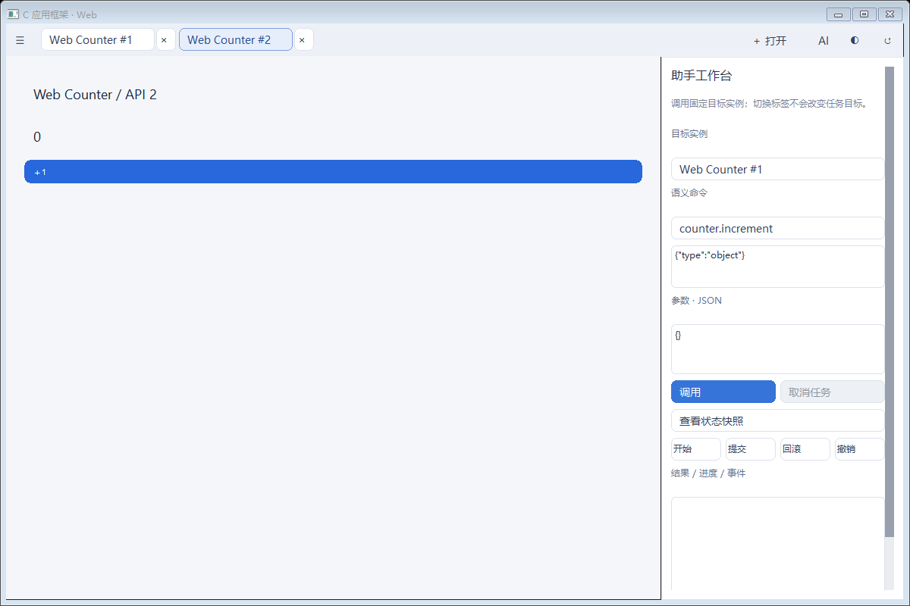
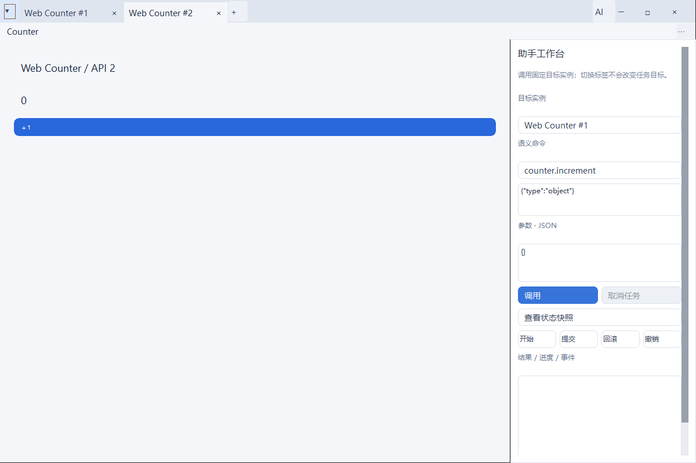

# 浏览器式独立宿主验收

2026-10-06，接手干净7ce1f2c506f578cbefaec2978581730f39956a9b，分支codex/menus-offscreen。先读handoff/开发标准/菜单及构建合同、API7/菜单/Runtime记录，再建立真实宿主失败用例。实现及最后测试代码本地提交d7030b3f85e73e98284fdaec15c88b77ac0789b8；后续文档提交不变运行代码。本轮无推送、远程工作流或稳定标签，不使用子代理/新会话/graph-engineering。

## 1. 实现与兼容

第一行为最近箭头、实例标签及关闭、加号、空白标题区、AI和窗口控制；第二行显示活动应用原菜单。“⋯”保留主题、布局重置和旧宿主操作。标签及最近列表分别分页；单页8项，关闭中禁用。标签宽88–180逻辑像素，400以下使用紧凑控制；极窄从标签列表访问。最近成功绝对路径最多12条，格式/身份/原子保存及失败边界见[使用说明](../standalone-host.md)。

保留Windows可缩放/系统菜单样式，以NCCALCSIZE移除传统标题区域；按DOM矩形分开HTCLIENT/HTMAXBUTTON/HTCAPTION及边缘。轻量子窗口非客户区透明，拖动/双击/缩放走Windows，系统菜单关闭和自绘关闭均进入原WM_CLOSE/REFUSE/WAIT路径。最大化客户区夹紧work area，DPI重新布局；系统Snap浮层仍待实际条件验收。

应用菜单继续原注册、侧向嵌套、键盘/鼠标、一次命令、焦点/模态/实例失效合同。调整宿主坐标以复用应用原菜单占位，不改应用布局描述或内容槽；标签、AI及布局保留原组件/GL。旧调用方无需为外观重编译。公共include、src实现、SDK1–6、原六包及PERF-001未改；API7/SDK0.7/标准7/ABI1/包格式1保持，没有提高原预算。

## 2. 环境和复验

Windows x64 10.0.26300.0、Session1交互桌面，MSVC19.50/VC14.50.35717、Windows SDK10.0.26100.0、C11/W4/WX，CMake/CTest4.2.3-msvc3、Ninja。Lexbor 7fb22cf5664a331d7c24b113489e566767c9c25a，QuickJS-NG 2f0aa72a6b09cf69ff06399bcf9f4c083ac1a278；WebView2 SDK1.0.4129.50，实际Evergreen154.0.4258.53；OSMesa Mesa24.3.4/llvmpipe固定DLL SHA256 c633b820bba8ec0dcb05466505e3c246e4c4028eaec7caf1054e707c8eb3ca1f。正常WGL为Intel UHD770、3.3 compatibility，硬件类别仍按查询unknown，不扩大硬件无窗口范围。

本地构建build/ci-webview2包含六个原API1–6包路径与固定OSMesa，源配置为现有可选全矩阵。按[构建说明](../build-and-validation.md)准备依赖及原包；缺原包明确未验，不用新包替代。

```powershell
cmake --build build/ci-webview2
ctest --test-dir build/ci-webview2 --output-on-failure --output-junit build/browser-host-evidence/full.xml
& .\build\ci-webview2\ui_browser_host_test.exe .\build\ci-webview2\web_counter.uapp .\build\ci-webview2\minimal_eda.uapp .\build\ci-webview2\ui_lifecycle_fixture.dll .\build\browser-host-evidence\delivery
```

原始[证据包](browser-host-evidence.zip)含full-identity.json、62项计划/实际XML、LastTest/log、源码/产物哈希、基线/失败/专项、截图原BMP与PNG像素一致清单、环境/兼容审计及交互GL真实帧。归档包含111个原字节文件，ZIP SHA256为e32833fb0979caebcffc6f185d92c9c765dc07d2e73873f0c6f0f30b9c32f587。内部index.json为原始字节SHA256清单；UTF16/UTF8/控制台编码保留，不用重编码覆盖原日志。临时日志启动脚本也归档；正式四行CI/Session0工作流没有改动。

## 3. 结果和失败修复

| 用例 | 实际结果 |
| --- | --- |
| 基线真实宿主 | 6个预期失败：最近入口、三个窗口按钮、传统标题高度；前后截图基线身份保留 |
| 独立普通桌面专项6项 | 6/6通过，25.96秒；最终完整矩阵再次运行相同专项 |
| 冻结d7030b3完整矩阵 | 62项：61 PASS、1物理跨屏SKIP、0失败，340.52秒；来源清洁，准确commit和二进制哈希在full-identity.json |
| 实际浏览器宿主用例 | 空/多标签/同包双实例、大小写去重、13路径淘汰、最近重开/失效/非法/初始化失败、未来格式拒绝、重建宿主加载、活动/后台/最后标签关闭、REFUSE/WAIT/拒绝等待/完成/卸载通过 |
| Windows和布局 | 真实SendInput拖动40,40→80,70，双击/自绘最大化按钮、最大化work area、边缘缩放、右键及Alt+Space系统菜单、最小化/还原通过；480px窗口与96/144/192程序DPI、标签溢出/末端路径、AI尺寸和固定目标、GL对象保留通过 |
| 宿主资源 | 完整矩阵24次实际DLL重开：handles313→313、GDI66→66、USER24→23；独立普通桌面314→314、315→315同类周期通过，原+12/+4断言保留 |
| 原菜单/焦点/模态 | 三级侧展、边缘逻辑翻转、菜单覆盖GL/native、双实例/确认/焦点、禁用与一次命令、Alt及编辑路由；40次菜单重开315→315、GDI682→682、USER47→47 |
| 实际Runtime与旧原包 | API5内置/原包各32重开：413→410与389→386，GDI9平稳、USER17/15平稳、pending0；API6/7轻量/Runtime集成及旧六包分别通过，SDK冻结及原包哈希审计PASS |
| 当前OSMesa交互对照 | 实际DLL200轮/400实例/2000命令，创建与现存HWND0；handles235→236、GDI0、USER2、private峰112144384低于原128MiB；samples0和4真GL帧/预算/resize/卸载通过。只算Session1 INTERACTIVE_CONTROL |

失败完整保留：首版多值border-radius导致轻量页面UNSUPPORTED，改为支持的单值；首次NCCALCSIZE只处理wParam=true保留标题高度，补首次RECT计算；真实右键系统菜单未打开，补标准系统菜单转交，随后右键和Alt+Space通过。测试Win32 mouse_event名称冲突、误把请求ID当状态码、误把嵌套按钮文本当子标签文本分别修正，完整语义断言保留。

受限桌面专项5通过/1失败：GetCursorPos/SendInput不可用，原动作/归属/尺寸断言全部保留，同二进制在普通桌面6/6通过。证据启动器缺Get-FileHash自动模块曾在任何测试前失败，改为.NET SHA256并保留启动错误；不计作执行结果。最早后台启动器没有进入测试的日志为空，也不冒充通过。历史Runtime/共享桌面失败仍按[稳定性记录](runtime-stability-validation.md)保留，本轮通过不主张永久根治。

## 4. 真实前后截图

以下是框架实际create_host、相同嵌入资源与真实应用DLL窗口的完整PrintWindow截图；没有效果图或替代绘图。SDK测试包装只为注入私有历史路径及断言，产品窗口布局/命中/生命周期相同。PNG与原BMP解码RGB逐像素一致。浅色与深色是宿主主题，应用自己的内容主题不自动改变。

修改前（7ce1f2c）：



修改后（d7030b3同一执行代码）：



[修改前深色](browser-host-before-dark.png)、[修改后深色](browser-host-after-dark.png)、[多标签及实际GL内容](browser-host-after-gl.png)。PrintWindow不等于桌面交换/DWM合成，遮挡/物理边缘仍另验。

## 5. 交付边界

本地实现、必要回归和文档交付完成。当前提交没有托管CI运行；没有推送/远程工作流授权，仅本地提交。当前源码Session0严格脚本在非管理员检查退出1，未创建输出目录/服务；历史78c24cb成功不能替代。用户已确认没有整机无登录服务runner，继续待验，不注销用户、不改既有服务或绕过权限。

真实中文IME、不同DPI物理显示器/屏幕边缘/Snap浮层/桌面合成、长期人工未具备验收条件。当前业务应用未指定且无修改授权，没有修改请求方应用；独立测试DLL仅算框架集成。没有OSMesa实测瓶颈/硬件需求，不扩大到硬件无窗口GL。上述缺项不阻塞本轮独立交付，但不宣称全部环境或业务验收完成。
