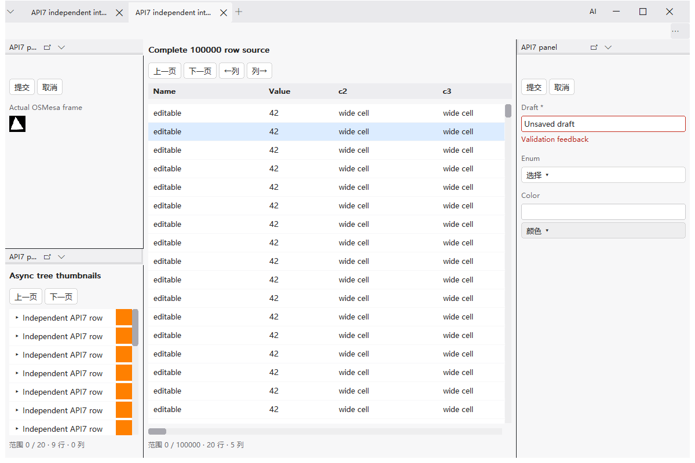
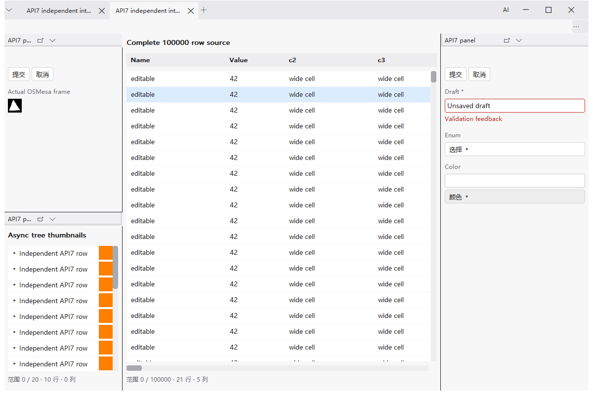
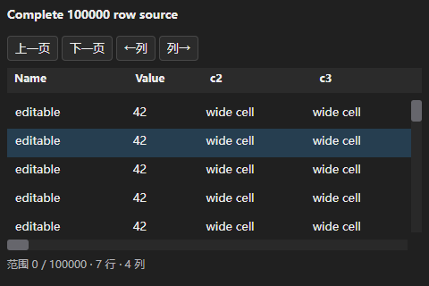
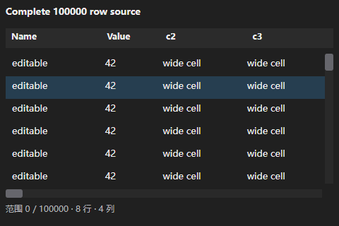

# API7 共同组件分页清理与当前版本验收

日期：2026-10-06。接手干净 bfa5b120216acde0bc33fd03ffa6f40e7c0c78db，分支codex/menus-offscreen。先核对handoff、标准、模板、完整范围滚动和现有验收；已有视觉/AI改动在基线中，不重复开发。本轮只本地交付，未推送、触发远程工作流或创建稳定标签。

## 1. 实现与身份

| 本地提交 | 可审查单元 |
| --- | --- |
| a3181d81caa94fb4289aa5071050bb3b5c57b56c | 共同树/列表/表格删除分页与列箭头控件；实际视口/查询及两后端DPI截图断言 |
| 702cd05a4ed4b8f7ec031d931e0004b3a46b4fc1 | 旧SDK/API/调用方/原包专项退出CMake/CI；当前功能夹具用API7头文件与声明，完整size/当前偏移检查保留 |
| 4b3fe3d96443ec9341840fc3899f769d69e24ef6 | 当前Session0 GL对照包声明API7；按注册测试归档run.log/资源CSV/实际帧，不再检查不存在的manifest.json |

文档与原字节证据另行提交，最终HEAD以git log/status为准。SDK0.7/API7/标准7、ABI1/包格式1不变；没有修改公共头文件、运行库旧版本接受分支、冻结SDK、历史验收记录、原包、请求方应用或PERF-001。当前基础功能不因最早在旧API引入而删除。[维护政策](../version-policy.md)从本轮起替代旧兼容承诺。

共同模板只为FORM/DIALOG构建提交/取消控件，数据组件隐藏该容器且没有分页/列箭头DOM或处理器。不是移到“更多”。公共数据源、查询、scrollbar、输入和资源预算代码保持。菜单、最近应用和标签溢出分页仍由原独立模板负责，并执行相关宿主/菜单回归。

## 2. 可复验用例与实际视口

先添加当前版本用例，再实施：ui_component_scroll与Runtime变体检查数据controls不可见、next-page不存在、回收高度和实际source收到的count；ui_visual_ui在两主题、96/144/192程序DPI查询真实呈现。旧模板4/4失败，修正后4/4通过。既有首末范围、状态和资源断言全部保留。

同一800×500逻辑组件，32行高：

| 组件 | 修改前 rows y / height / 首次查询 | 修改后 | 回收 |
| --- | --- | --- | --- |
| TABLE | 112 / 328 / first0,count13 | 76 / 364 / first0,count14 | 36逻辑像素 |
| TREE/LIST | 76 / 384 / first0,count14 | 40 / 420 / first0,count16 | 36逻辑像素 |

树/列表/十万行表格末端拖动、首项恢复、64列宽表第63列单元格实际可见；十万行表格末项ID100000可见，first99989。UINT64_MAX总量18446744073709551615对应first18446744073709551604，JS BigInt和稳定ID不改。空数据/单项无纵条，拖动中换源/排序/总量缩小、Esc/CANCEL/实例失活、迟到批次CANCELLED、树展开到200000/折叠回100000、轨道点击与原预算均通过。滚轮/Shift滚轮/键盘编辑、双实例、模态和焦点由共同体验及集成用例继续验证。

宽表查询仍按完整列宽确定窗口，表格节点≤1024、缓存≤2MiB，单批512、图片32MiB、投递8MiB、JS8MiB保持。没有预加载全数据。应用继续返回真实total_count和first/count窗口，已遵守API7合同无需修改或重编译。

## 3. 实际回归和失败保全

| 运行 | 实际结果 | 原始证据 |
| --- | --- | --- |
| 测试先行，旧模板 | 4失败，18.53s；分页存在及视口未回收 | pager-red.* |
| 分页最终专项 | 4通过，18.34s | pager-final.* |
| 当前政策首轮smoke | 8通过/1失败，26.70s | current-smoke.* |
| 夹具修正smoke | 9通过，26.47s | current-smoke-fixed.* |
| native | 20通过/1物理跳过，5.59s | matrix-fixed-native/ |
| light | 40通过/1物理跳过，39.16s | matrix-fixed-light/ |
| osmesa | 44通过/1物理跳过，37.79+45.03s | matrix-fixed-osmesa/ |
| WebView2首轮 | 50通过/1失败/1物理跳过，38.27+45.00+66.40s | matrix-fixed-webview2/ |
| 关闭独立复验 | 3个进程各1/1通过，8.99/8.98/8.95s | runtime-independent-1..3.* |
| Runtime阶段复验 | 7/7通过，51.88s | runtime-phase-recheck.* |
| WebView2完整复验 | 51通过/1物理跳过，全部阶段非零失败检查保持 | matrix-final-webview2/ |
| 当前API7对照包及归档复验 | 51通过/1物理跳过，38.81+45.00+50.04s；原GL日志/CSV/帧已归档 | matrix-delivery-webview2/ |
| 包声明审计 | 先发现Session0包API5；修正后7个当前功能包全部声明7 | current-packages-red/fixed.* |
| CI门槛 | 测试先行拒绝仍选旧专项的helper，修正后PASS；空/遗漏/重复/失败/异常skip和旧专项均拒绝 | ci-policy-red/fixed.* |

native/light/osmesa及WebView2首轮manifest绑定a3181d8+当时未提交政策变更（随后提交702cd05）；初轮布局夹具错误修正后代码未再变化。完整WebView2复验与前后图的after绑定702cd05，仅文档dirty。4b3fe3d只追加当前对照包声明与归档条件；最终执行身份、实际二进制和精确测试清单以各目录manifest.json/test-plan.json为准，不把dirty记录改成clean，也不把早期结果冒充后续源码重跑。

当前布局测试改用API7头文件后仍用格式1的80字节头破坏数据，6条断言失败；实际格式2为96字节头/112记录。只修正测试数据位置，重复ID、非法UTF-8、缺失面板及512记录等原断言保留，产品layout代码不改。

**Runtime首轮失败仍未根治。** ui_webview2_render第45行在原15秒内内部cleanup窗口未归零；呈现/捕获/图片/输入已通过，随后的12次创建期取消handles291→288、USER18→17、pending0。三个同二进制独立进程及整个Runtime阶段随后通过，完整行再通过。这限定了复现条件，不能证明超时原因或永久修复。没有改Runtime产品代码、延时、+12句柄/+2 USER门槛，不强杀进程或清理用户数据。失败JUnit/日志和失败退出1保留，后续通过不覆盖初轮。

本地启动器错误单列：Windows PowerShell在VsDevCmd环境找不到Get-FileHash，构建exit0但尚未运行CTest，改用文档要求的PowerShell7；CI helper及smoke启动器的JavaScript替换导致正则被插入旧文本，修正后复验；最后delivery启动器裁剪范围错误导致解析失败，未执行测试，改成显式脚本并先解析。原脚本、错误及exit在ci-policy-parser-red、smoke-parser-red、delivery-parser-red与matrix-launch中保留。这些不是产品测试通过或Runtime失败。

## 4. 真实前后截图

两边使用同一个api7_fixture.uapp及DLL，包SHA256 **ec45661fc6f24f1d60216d7ca430d652d97e73874d74fa55a937f3d9a90de98f**，DLL **f0890edad63531129f0fe07fe95af04884e092040b45ff2d8b41f9217f699de4**，均不变。框架测试应用的十万行/64列、20项异步树缩略图、属性草稿与校验反馈、实际OSMesa frame C图片和双实例一致。不是请求方业务验收。

before为干净bfa5b12实际运行；after为702cd05实际运行。相同1200×800外框、480×320逻辑表格捕获、同一数据、相同主题/程序DPI；依赖及桌面条件相同。正常PrintWindow客户区及公共C捕获各保存20 BMP/后端，共80原始图；截图模式两个后端各exit0。20张对照PNG只作BMP→RGB无损格式转换，不裁剪、缩放或拼接，逐像素比较相等，详情见screenshot-index.json。系统/客户区图不冒充桌面合成或真实IME证据。

轻量真实宿主，浅色修改前：



轻量真实宿主，浅色修改后：



真实WebView2共同表格，深色修改前：



真实WebView2共同表格，深色修改后：



其他同条件对照：[轻量深色前](component-scroll-before-light-host-dark.png)/[后](component-scroll-after-light-host-dark.png)、[Runtime浅色宿主前](component-scroll-before-webview2-host-light.png)/[后](component-scroll-after-webview2-host-light.png)、[Runtime深色宿主前](component-scroll-before-webview2-host-dark.png)/[后](component-scroll-after-webview2-host-dark.png)、[轻量表格前](component-scroll-before-light-table-light-96.png)/[后](component-scroll-after-light-table-light-96.png)、[轻量树前](component-scroll-before-light-tree-light.png)/[后](component-scroll-after-light-tree-light.png)、[Runtime树前](component-scroll-before-webview2-tree-light.png)/[后](component-scroll-after-webview2-tree-light.png)。其余96/144/192 DPI、属性、颜色、枚举、AI和窄窗原图在证据ZIP。

## 5. 环境、依赖与复现

实际Windows x64 10.0.26300.0、已登录Session1、2560×1440桌面/系统96 DPI，程序DPI96/144/192；MSVC19.50、VS Build Tools18、Windows SDK10.0.26100.0、C11 /W4 /WX，CTest4.2.3-msvc3及PowerShell7。实际WebView2 Runtime154.0.4258.53，SDK1.0.4129.50（最低Runtime138.0.3351.48）。Lexbor固定7fb22cf5664a331d7c24b113489e566767c9c25a，QuickJS-NG固定2f0aa72a6b09cf69ff06399bcf9f4c083ac1a278。

显式x64 Mesa24.3.4/OSMesa，osmesa.dll SHA256 c633b820bba8ec0dcb05466505e3c246e4c4028eaec7caf1054e707c8eb3ca1f；实际llvmpipe LLVM19.1.7/GL4.5 Compatibility，MSAA4及非MSAA0通过。按现有CI隔离软件WGL、显式OSMesa/provider与Runtime平台图形阶段，GALLIUM_DRIVER=llvmpipe，不改变系统OpenGL，不将软件GL当硬件。此前D3D12环境崩溃仍属[历史记录](visual-ui-validation.md#3-测试与失败)，本轮没有宣称修复。

在准备固定依赖的x64开发终端，PowerShell7执行：

```powershell
./tools/test-windows-ci.ps1
# 已准备固定依赖可直接build/test；新环境先按构建说明prepare。
foreach ($row in @('native','light','osmesa','webview2')) {
    $ev = "build/new-scroll-evidence-$row"
    ./tools/windows-ci.ps1 -Configuration $row -Stage build -EvidenceDirectory $ev
    ./tools/windows-ci.ps1 -Configuration $row -Stage test -EvidenceDirectory $ev
}
ctest --test-dir build/ci-webview2 --output-on-failure -R '^ui_component_scroll(_webview2)?$'
& ./build/ci-webview2/ui_visual_ui_test.exe ./build/ci-webview2/api7_fixture.uapp "$PWD/.deps/mesa-24.3.4/x64/osmesa.dll" light "$PWD/build/new-scroll-evidence-light/host"
& ./build/ci-webview2/ui_visual_ui_test.exe ./build/ci-webview2/api7_fixture.uapp "$PWD/.deps/mesa-24.3.4/x64/osmesa.dll" webview2 "$PWD/build/new-scroll-evidence-webview2/host"
```

保留每个失败，不复用证据目录覆盖历史。current_only摘要、精确清单、JUnit、完整输出、实际二进制hash、依赖与Session对照原文件随每行归档。严格服务工作流仍保持整机无登录门槛；本机上述运行没有GitHub run ID，不能算托管CI。

## 6. 证据及剩余限制

[原字节证据ZIP](component-scroll-only-evidence.zip)包含本轮失败/修复/最终日志、JUnit、LastTest、清单、身份、启动器、80个原BMP及真实GL帧。evidence-index.json列每文件SHA256与字节数，归档后逐项比对原文件；新文档、链接、代码保护路径和当前版本语义检查独立记录。历史validation文件和冻结SDK不改。

当前实现/本机分页回归完成，Runtime排空超时的不确定性继续记录。真实中文IME、不同缩放物理屏幕/边缘与桌面合成、长期人工均未验收；程序输入/DPI和PrintWindow不能替代。无严格整机无登录服务runner，当前Session0也未在服务环境复验；本轮API7实际GL对照是Session1，不继承历史Session0成功。未指定并授权真实业务试点，未修改请求方应用；不扩大到硬件无窗口GL。

4b3fe3d当前API7包的Session1 GL对照：200周期/400实例/2000命令，created/process HWND均0，module_shutdown live_instances/live_surfaces均0，句柄191→192（原+2门槛）、GDI0→0、USER2→2，private峰值109,764,608字节低于原128MiB。精确样本及八张应用实际GL帧在matrix-delivery-webview2/session0-interactive-control；它是INTERACTIVE_CONTROL，不是Session0或无登录成功。

首轮CI的旧归档条件未保存Session对照原目录；后续运行器复用该输出目录会覆盖同名文件，因此不补造首轮CSV。初轮CTest结果/身份仍保留，最终4b3fe3d归档以本轮真实输出为准。

最终4b3fe3d四行均已重跑（仅文档/截图dirty，产品源码已提交）：native20PASS/1物理SKIP，5.33s；light40PASS/1SKIP，44.51s；osmesa44PASS/1SKIP，44.60+48.21s；webview2 51PASS/1SKIP，38.81+45.00+50.04s。合计159次测试执行、155PASS/4次同一物理跨屏条件SKIP、0FAIL，阶段测试总时间276.50s，不是159项独立功能。所有test.exit=0，精确清单无历史专项；两提供方行实际归档24个Session1对照文件，SHA/原字节比对全部一致。该最终结果不覆盖前文首轮Runtime失败，也不算托管CI或物理验收。

交付检查：16份入口/说明文档348个本地链接及代码围栏通过（证据ZIP创建后）。保护路径diff为空，当前公共头文件、SDK1–6、历史fixture/基线和历史验收未改；git diff --check通过。原字节ZIP各文件均与原文件逐字节一致，最终完整性以ZIP内evidence-index.json和提交Git blob为准。
