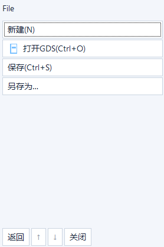
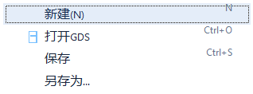
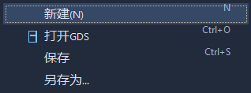

# 桌面菜单外观与鼠标交互验收

日期：2026-10-05。本轮完成框架宿主菜单内部修正，SDK0.6/API6、应用ABI1及包格式1保持。自动输入、客户区截图和独立框架DLL集成与真实IME、物理跨屏、桌面合成及长期人工验收分别记录。

## 1. 基线、设计与本地提交

接手时`codex/menus-offscreen`干净，HEAD为`c4c5a91b11c0ab0a3b2d405d9e385fac76bab861`；已阅读handoff、菜单/离屏合同、开发标准与API5/API6验收，并核对菜单C、HTML、宿主和现有测试。没有覆盖接手时用户改动。

| 单元 | 本地提交 / 内容 |
| --- | --- |
| 桌面菜单实现 | `6bf59f8c4264634c808f5766278739615106c15a`：新增测试、分离菜单/工具/标签样式、侧向展开、悬停/外部点击/重复入口、边缘翻转及链预算 |
| 回归修复 | `2917b44e8573d6446b2b9410c7707d93dfa6eecf`：框架☰菜单外部点击及Esc关闭、焦点恢复、F1等虚拟键名称，保留并扩展原宿主关闭断言 |
| 高度修正 | `d907fbd`：无分页菜单只保留8px外沿，分页仍保留上下入口；先捕获72px失败，再验证单行36px及原分页末项 |
| 初始化失败清理 | `d2e4a61`：hook创建失败后的宿主引用回收，单元状态复现失败后修正；不作为真实OS失败注入或菜单呈现证据 |
| 桌面用例收敛 | `b1f4c7b`：仅测试窗口置顶；真实鼠标可访问时保存/移出测试区/结束恢复，隔离外窗遮挡与悬停提示；观察分支不改变鼠标或窗口层级 |
| 最终测试源码 | `b1f4c7bfcaf19af4990dbd8f791b457c838257e7`；其后文档/证据提交不改变产品或测试代码，实际交付HEAD以Git为准 |

采用既有轻量Web页面、菜单注册和命令投递：菜单入口平面26px，工具入口与应用标签各自有样式；弹出菜单28px连续行，勾选、图像、标题、快捷键和子组箭头分别对齐。浅/深主题、禁用和展开高亮均按作用域定义，普通按钮原样式保留。

每个缓存层复用原view/窗口生命周期，父层继续可见，子层按work area右展或左翻；父层候选切换有160ms跨层宽限。重复点击当前入口关闭，外部点击关闭并继续投递该点击；线程消息hook仅在菜单打开时安装，关闭卸载。实例切换、模态、锚点失效和销毁关闭整链。Alt/助记/方向/Enter/Esc沿用原合同，叶命令校验后只执行一次。详见[接口与行为说明](../framework-menu-offscreen.md#桌面菜单样式与指针交互)。

依赖与兼容策略：Windows x64/C11，原命令/菜单C ABI、字段size读取、枚举及所有权均未改；仅私有host尾部追加菜单状态。单层128项、分页最多10项、节点1024及像素32MiB门槛保持。链按每缓存层最坏76节点预留，最多13层，DPI像素另验；超预算关闭链，完整注册路径仍可直接打开。无窗口逻辑展开、命中和当前层RGBA捕获不创建菜单HWND；公共呈现/输入/flush/捕获作用于当前最深可见层。

## 2. 可复验用例与最终结果

先增加[实际宿主用例](../../tests/menu_desktop.c)和[无窗口用例](../../tests/menu_cascade_offscreen.c)，再实现；不是只验证接口存在或编译成功。

| 用例 | 覆盖与结果 |
| --- | --- |
| 菜单专项5项 | `ui_framework_features_host`、`ui_menu_desktop`、`ui_menu_offscreen`、`ui_menu_cascade_offscreen`、`ui_menu_access`：5 PASS，7.89s；[日志](menu-target.log) |
| 真实宿主/实际DLL | framework_features.uapp及原生GL内容，3层菜单WindowFromPoint根窗口命中；父子跨越取消待切换；禁用项0调用、叶命令1调用；重复入口、顶层悬停、工作区边缘翻转、外部点击、模态、双实例及焦点恢复通过 |
| 重开和回收 | 同一菜单链预建缓存后40次重开，原句柄/GDI/USER阈值不变；最终关闭实例及宿主，所有菜单HWND（含隐藏缓存）为0；最终截图复验句柄318→318、GDI635→635、USER49→49，见[用例日志](menu-cascade-final.log)；完整矩阵详细数值见[完整用例输出](menu-full-output.log) |
| 溢出/DPI/预算 | 480px窄窗在程序96/144/192 DPI下“更多”可达；单层128项通过键盘分页到末项并执行一次；129项失败，20层路径在第13缓存层预算关闭、随后仍可直接打开；无窗口菜单HWND为0 |
| 框架☰关闭回归 | 原宿主用例保留deferred-close断言，以Esc替代已隐藏的旧关闭按钮，增加重复入口和外部原生点击；长详情弹窗原关闭按钮断言仍保留 |
| 原生构建 | 21项：20 PASS / 1物理跨屏SKIP，4.78s；[日志](menu-native.log) |
| 完整构建 | 53项：52 PASS / 1物理跨屏SKIP，264.36s；[完整结果](menu-full.log)、[逐项输出](menu-full-output.log)、[JUnit](menu-full.xml)。旧菜单、组件编辑、模态、GL/MSAA/非MSAA、实际Runtime、应用DLL与五个原包均通过 |

在[构建说明](../build-and-validation.md#菜单外观与鼠标回归)的固定依赖环境，使用同一配置运行：

```powershell
cmake --build build/fw-next/release
ctest --test-dir build/fw-next/release -R "ui_menu_desktop|ui_menu_cascade_offscreen|ui_menu_access|ui_menu_offscreen|ui_framework_features_host|ui_web_host_frontend" --output-on-failure
ctest --test-dir build/fw-next/release --output-on-failure
cmake --build build/api6/native
ctest --test-dir build/api6/native --output-on-failure
```

最终本机为Windows NT10.0.26300、Session1、1920×1080、DPI96、1个显示器。MSVC19.50/x64、Windows SDK10.0.26100、Lexbor与QuickJS-NG沿用固定commit、WebView2 SDK1.0.4129.50 / 实际Runtime154.0.4258.53、OSMesa24.3.4；配置、精确依赖和文件哈希见[环境证据](menu-environment.json)。Runtime回归在允许其正常子进程的执行环境运行。原CI矩阵会自动包含新增CTest；本轮仅本地交付，没有上传源码或新触发远端CI，API6历史CI绿色不作为本轮源码的新CI证据。

## 3. 失败、定位与修复

[失败汇总](menu-failures-and-fixes.log)保留以下顺序和边界，不删除失败断言或提高资源门槛：

1. 原c4c5a91实现运行新宿主用例11失败：入口高度、父子并列、深层点击、顶层悬停/重复入口、外部点击与模态链；原输出摘录已保留，初次原始日志被后续脚本覆盖，不能当作原始日志哈希。
2. 第一版HTML四值border-radius超出轻量CSS支持而初始化失败；改回支持的单值半径。缓存菜单重开保留旧选择造成4个键盘失败，修正目标组初始选择；[原失败](menu-first-implementation-failure.log)。
3. 紧凑入口在640px仍全部容纳，旧新建窄窗fixture错误期待“更多”；改用480px真实溢出条件，保留640失败，不修改菜单可达断言或预算。
4. 首次正常完整53项有两项失败：[完整失败日志](menu-first-full-failure.log)。旧测试点击已隐藏的关闭按钮，改测真实Esc且继续检查回调退出后销毁；另外GDI增加6个对象。
5. GDI诊断显示增量在首次将缓存子层从Deep内容切换到Pointer内容，20/40轮无继续增长。先建立被测同一链再取基线；原`+12`句柄、`+4`GDI/USER阈值和40轮焦点断言保留。这是缓存建立与重复回收口径修正，不宣称修复了未证实的GDI泄漏；[诊断失败](menu-cache-diagnosis-failure.log)。
6. 新框架☰外部原生点击用例复现未关闭。增加仅UI线程菜单期hook、锚点重复点击豁免、失活清理及有效焦点恢复；最终原宿主用例通过。
7. F1虚拟键112原显示为`Ctrl+p`；给快捷键子节点稳定内部ID后直接查询实际文本，保留[失败](menu-function-key-reproduction.log)，修正为F1–F24及常见导航键名称；最终实际文本`Ctrl+F1`。
8. 最终图像复查发现无分页层仍保留36px旧页脚。新增实际RGBA尺寸用例先复现，改为无分页仅8px外沿；有分页的上下入口仍保留，128项118次步进到末项仍通过。
9. 受限执行环境中Runtime导航/初始化超时，保留[中断日志](menu-sandbox-interrupted.log)。主动终止本轮测试后，在正常环境执行原相同断言及同一Runtime；受限失败不改成通过，也不代表Runtime功能失败已被源码修复。

10. 2917b44完整矩阵一次API6 Runtime重开资源失败（374→416，原+12阈值），诊断时pending Runtime cleanup=0；[失败输出](menu-runtime-resource-failure-output.log)保留。相同源码、同一实际Runtime、DLL与原断言单独运行11.45s通过，386→387；[复验](menu-runtime-isolated-output.log)。当前没有定位偶发资源增量原因，不称菜单改动修复了这个Runtime问题；b1f4c7b最终完整53项52PASS/1SKIP，API6 Runtime重开句柄385→394（原+12阈值通过）；失败保留，稳定性追查仍待续。

11. 收尾增加hook初始化未完成的清理单元，先复现借用宿主引用未归零；[失败](menu-hook-failure.log)。移除“必须有有效hook才清引用”的条件。正常真实菜单与回调销毁仍另行回归，不将此状态模型作为真实OS失败注入证据。

12. d2e4a61完整矩阵曾有3个WindowFromPoint断言及实例切换窗口数断言失败，其他测试通过；[旧失败](menu-desktop-interference-failure.log)保留。旧输出缺命中类诊断，不能追溯具体遮挡来源。新增诊断，并显式证明菜单关闭时工具提示仍可创建同一窗口类。测试窗口置顶、在可访问真实鼠标时保存/移出测试区/最后恢复，所有原命中、关闭、一次命令及资源断言保留。受限环境无输入桌面鼠标权限时记录该条件，不虚构物理输入；仍执行原窗口和程序输入断言。只读观察分支不应用置顶/移动鼠标准备。这是复验fixture条件收敛，不把它称为桌面合成或生产菜单的置顶实现。

## 4. 请求方应用只读前后观察

使用现有`D:/应用软件框架/klayoutC/build/view-settings-dev/klayoutc.uapp`。只读观察分支只打开/关闭首个菜单File并切换宿主主题，应用命令调用0；未修改其源码、文件、SDK或原包，没有打开/修改业务文档。原目录不是Git仓库，不能声称其Git工作区干净。

包前/后SHA256均为`47ebf008fa7f049da0999ae601142023c6a7182d6c4580e8b9e88ef8480702a0`；[只读观察日志](menu-requester-observation.log)。修改前为基线c4c5a91宿主源码，加只读测试观察入口；修改后为最终b1f4c7b源码（产品实现仍为d2e4a61）。PNG是PrintWindow真实客户区BMP的无损RGB转换；入口裁图仅裁取原像素，完整图保留，未生成替代UI或GL图片。

| 浅色入口前 | 浅色入口后 |
| --- | --- |
|  |  |

| 浅色菜单前 | 浅色菜单后 | 深色菜单后 |
| --- | --- | --- |
|  |  |  |

完整宿主客户区：[浅色前](menu-before-light-host.png)、[浅色后](menu-after-light-host.png)、[深色前](menu-before-dark-host.png)、[深色后](menu-after-dark-host.png)；[深色旧菜单](menu-before-dark-menu.png)保留，显示旧popup未同步深色。框架独立DLL的三级连续菜单见[根File](menu-cascade-2.png)、[子层Pointer](menu-cascade-1.png)、[叶层Deep](menu-cascade-0.png)。客户区截图不覆盖桌面交换、IME候选窗、物理跨屏效果或GL业务绘制验收。

## 5. 兼容及剩余限制

公共头文件相对接手基线完全不变，SDK1–5、API5 frozen测试和五个原包均未改；[兼容校验](menu-compatibility.log)记录哈希与比对结果。最终完整矩阵使用旧API1/2/3混合调用方、原API4及原API5包进行实际加载/命令/关闭回归，缺包不冒充通过。API6调用方回归沿用真实独立DLL。没有新增公共API，不需应用重编译或迁移菜单注册；更新运行库及框架宿主页即可使用本轮菜单。

| 条件 | 当前结论 |
| --- | --- |
| 严格整机无登录runner | 用户已确认没有；保持待验，不注销用户或改既有服务。历史OSMesa Session0成功属于[专门记录](session0-osmesa-validation.md)，本轮未重跑Session0 |
| 中文IME、不同缩放物理显示器/真实屏幕边缘、桌面合成、长期人工 | 本机单显示器；没有受控真实IME或长期人工操作条件，仍待验。程序DPI、work area翻转、有限重开及WindowFromPoint不代替这些验收 |
| 真实业务应用 | 本轮KLayout仅只读菜单观察，未获业务修改/适配授权，不算完整业务应用验收；组合DLL仍仅框架集成证据 |
| Runtime资源波动 | 保留过一次非菜单API6重开句柄断言失败及相同源码独立通过；原因未定位，不以最终单次通过声称长期稳定性完全验收 |
| 极深菜单 | 缓存链最多13层且受共同像素预算约束；不提高原预算，完整深路径可直接打开 |
| 发布状态 | 按本轮要求本地提交交付；没有推送、强推、新稳定标签或新CI运行 |

本轮菜单实现、自动回归和文档交付与上述未验收环境条件分别报告，不宣称所有验收已通过。
