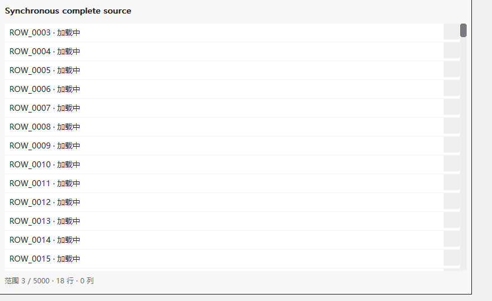
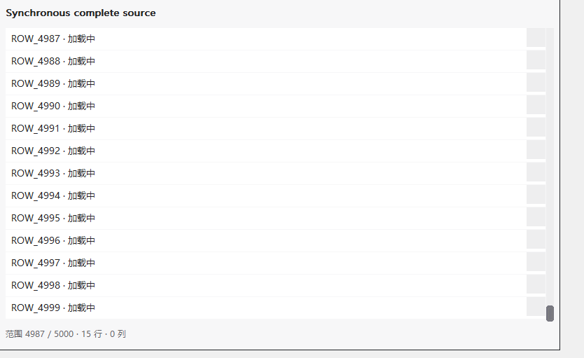
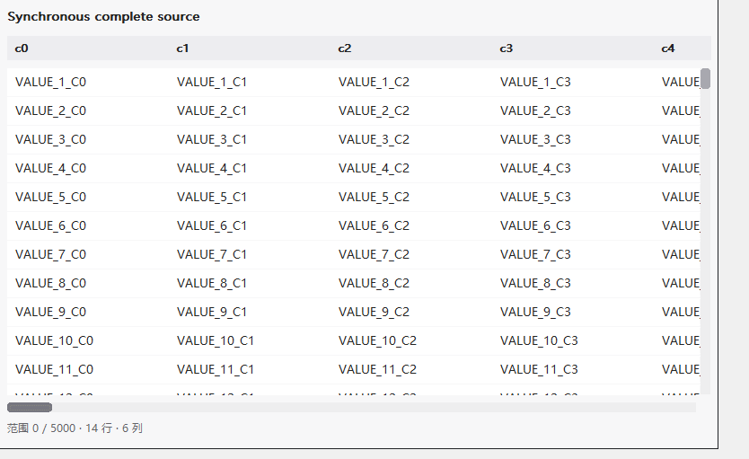
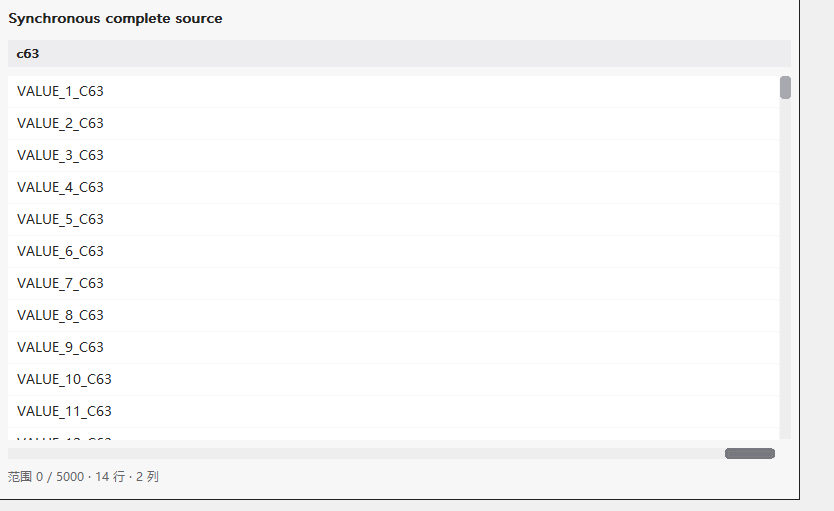
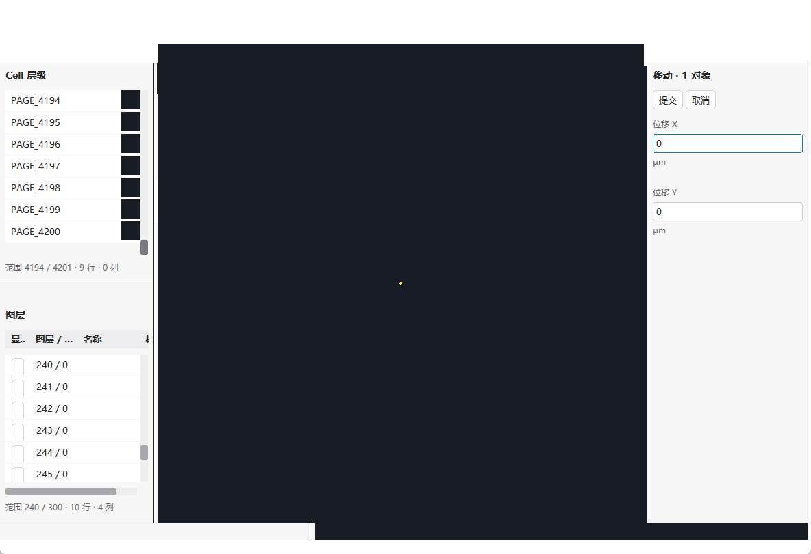
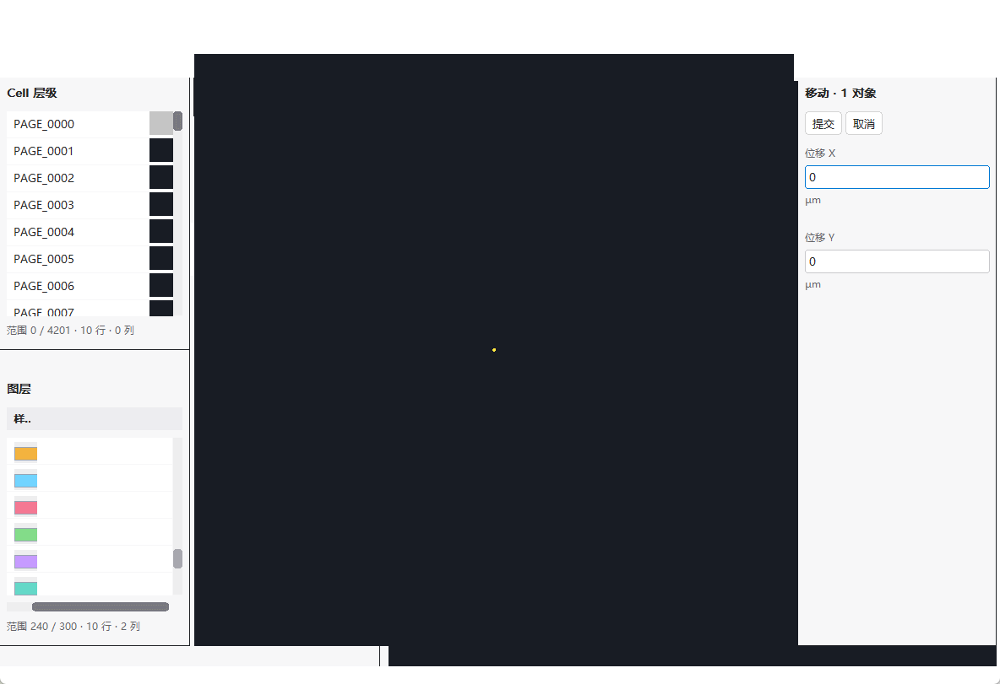

# 原生共同组件滚动修复验收（2026-10-07）

本轮三项已完成原生真实鼠标与当前业务自动复验。产品代码提交为 9df202fb8ae19dc79ae757f730743445fc939518、2e87e021443a38dbdd986a2bebd370e658c65242。SDK0.7.0-dev/API7/标准7、ABI1/入口/包格式不变；公共头文件相对0744d17无差异。所有提交只在本地，未推送、发布或创建稳定标签。

## 身份与只读边界

- 锁定框架起点0744d17aebe28e6231aa2088f0a33fa6fd34f091，已跟踪工作区干净。
- 应用只读仓库接手HEAD42d862435c883633f8ba8badb7a996c4c0710e19；代码、测试、工具、CMake、资源、vendor和原锁相对构建代码a727103c72a428a7adb7f5e45c2864497184a3a0无差异。此HEAD含后续文档，不冒称DLL构建代码提交。
- 读取用户指定5份资料，接手/结束SHA一致，见[最终只读核对](native-scroll-20261007/readonly-final-verification.json)。原应用仓库、冻结SDK、原包、历史成功/失败证据及PERF-001均未写入；没有执行历史EXE/应用包。
- 从当前应用Git归档复制到框架新的build/native-scroll-20261007/application-source，仅在副本更新SDK依赖锁，业务实现未改。新构建、测试、临时数据、截图和交付均在该独立目录内。
- 最终DLL/UAPP/runtime/host/测试EXE前后哈希一致，见[绑定](native-scroll-20261007/application-source-binding-final.json)、[前](native-scroll-20261007/application-final-hashes-before.json)、[后](native-scroll-20261007/application-final-hashes-after.json)。标准7坐标、size、线程、复制所有权与卸载合同保留。

## 根因与最小修复

1. 原生按钮按下已捕获HWND；DOM setPointerCapture再次对同一HWND调用SetCapture，同步产生WM_CAPTURECHANGED，触发lostpointercapture并恢复起点。后续MOVE实际完成派发时拖动状态已清空。9df202f仅避免重复捕获；真正失捕获仍取消。不是坐标错位、未完成Dispatch、业务handler/worker或最终脚本栈异常。
2. 完整业务回归暴露另一条回首项失败：TREE加载/空状态作为普通flex兄弟占用40逻辑像素，异步批次间轨道203/243跳变。取得的thumb中心在按下前已变成轨道，捕获为空，轨道点击反而改变位置。先用受控异步源+真实鼠标复现，再由2e87e02将同一节点放进rows的绝对覆盖层；不增节点，提示仍在rows中接受滚轮冒泡，不改变数据或预算。
3. 固定1024节点/2MiB缓存，真实total_count、稳定非零ID、uint64/BigInt、按需列查询、草稿/焦点/排序和资源合同未改。无Home/End或直接handler替代三项鼠标断言；业务原用例中的后置键盘对照另列，不作为鼠标证据。

[临时内部诊断](native-scroll-20261007/diagnostic-repro.log)同时记录真实输入进入dispatch、捕获取消及查询。临时诊断代码已移出产品，随证据归档；不能仅凭GETMESSAGE日志证明Dispatch完成。

## 失败保留与最终结果

| 执行 | 结果 |
| --- | --- |
| 锁定0744基线、原公共C复现 | 可见性前提成立后3项失败；TREE first0到底失败，真实wheel后first3回首失败，TABLE col0末列失败 |
| 新原生TREE/LIST/TABLE用例、基线 | 39条失败保留，覆盖3 DPI、重复、resize/焦点；未放宽 |
| 捕获修复后原复现 | 0失败；TREE first4987显示ID5000/ROW_4999，回首显示ID1/ROW_0000，TABLE col63显示VALUE_1_C63 |
| 捕获修复后业务原工作区单项 | 89/89；随后完整矩阵26/27，工作区4条失败，保留并定位异步轨道变化 |
| 新异步定位用例 | TREE轨道缩小/恢复2条失败。新增LIST“出现空占位”假设不成立（LIST保留旧缓存页），相关原日志保留；定位用例限定实际显示占位的TREE，断言函数保留，不削弱三类鼠标回归 |
| 两处修复后完整框架轻量 | 41通过、1物理跨屏跳过、0失败，59.41秒；含新真实鼠标、编辑/IME路由程序回归、菜单、布局、GL/MSAA/非MSAA及生命周期 |
| 既有真实WebView2 Runtime相关 | 呈现、组件体验、完整范围滚动3/3，41.40秒；不替代原生鼠标 |
| 两处修复后当前真实业务完整 | 27/27，218.11秒；真实宿主、GL、输入、表格/属性、布局、双实例、异步、模态/关闭卸载 |
| 框架侧业务只读观察补证 | 95/95；保留原用例，再增加鼠标首末截图、最后稳定列表头/内容clip。TREE ID8589938792/PAGE_4200与ID8589934592/PAGE_0000可见；业务4列图层表最后style列column3、rowID241、clip8,76,36,30，实际彩色样式像素 |
| 最终随包同一DLL的原生C复验 | 0失败；TREE/LIST/64列、独立真实wheel first3→顶部、首末ID/文字/非空clip、末列初始未查询→按需62+2查询、重复、resize、焦点、Esc/实际捕获丢失及TREE异步几何、96/144/192程序DPI |

当前CI校验器本机单元通过；42项实际JUnit与独立CTest JSON配置清单一致，移除原生鼠标项后正确拒绝，见[CI清单校验](native-scroll-20261007/ci-final-verification.log)。没有远程工作流执行。

最终框架轻量/Runtime产物与目录绑定见[产物身份](native-scroll-20261007/final-framework-artifacts.json)；早期fixture-binary-hashes.json保留初次捕获修复阶段，不冒称最终DLL。业务与随包DLL另由前后哈希绑定。

日志分别保留[基线](native-scroll-20261007/baseline-visible-repro.log)、[首次完整业务失败](native-scroll-20261007/business-full.log)、[最终完整业务](native-scroll-20261007/business-final-full.log)、[补证](native-scroll-20261007/business-observation-final.log)、[最终框架](native-scroll-20261007/framework-light-full.log)、[Runtime](native-scroll-20261007/runtime-related.log)、[最终SDK原生](native-scroll-20261007/sdk-native-final.log)。

证据目录使用局部.gitattributes保留原始文件字节和换行；CTest计划及工具日志自带行尾空格，保留原文，不为提交格式化日志。

首次Hidden启动导致根窗口未显示、命中其他进程的9条环境失败独立保存；新用例明确再次ShowWindow并验证实际可见/PID/捕获。首次误用静态库链接的构建失败也留档。它们不冒充有效产品复现；未将历史262KiB栈问题作为本轮根因。

严格“未查询列”使用框架C源只提交请求列，初始不含c63，拖后明确查询62+2并显示c63。业务本身只有4列、源每行提供4 cells；其末列为样式图像，证明是最后稳定列/实际像素可访问，不伪造64列业务数据或把空text当作VALUE文字。

## 真实截图

所有图片来自实际HWND/公共C或新业务DLL运行；BMP→PNG逐像素相等，不含生成图、静态HTML或软件替代应用GL画面。[原图哈希/尺寸/无损核对](native-scroll-20261007/screenshots.json)。公共C前后为同源5000项/64列、800×500逻辑视口、浅色、同DPI及相同拖动操作；截图“before”绑定0744，“after”绑定最终随包DLL2e87e02。

| 用例（96程序DPI） | 修复前 | 修复后 |
| --- | --- | --- |
| TREE到底 |  |  |
| 宽表末列 |  |  |

LIST和144/192图片同目录。业务截图分别为实际鼠标操作前、末Cell、首Cell、末样式列，均使用最终源码，不能把“操作前”称为旧SDK业务截图：

## 环境、依赖与复验

Windows10.0.26300、Session1已登录桌面；x64 MSVC19.50.35727、Windows SDK10.0.26100.0、CMake/CTest4.2.3-msvc3。Lexbor7fb22cf5664a331d7c24b113489e566767c9c25a、QuickJS-NG2f0aa72a6b09cf69ff06399bcf9f4c083ac1a278。Runtime SDK1.0.4129.50、实际Runtime154.0.4258.53。[环境](native-scroll-20261007/windows-environment.json)、[依赖](native-scroll-20261007/runtime-dependencies.json)。

从x64 VS开发终端、仓库根目录：

    cmake -S . -B build/native-scroll-20261007/patched -G Ninja -DCMAKE_BUILD_TYPE=Release
    cmake --build build/native-scroll-20261007/patched
    ctest --test-dir build/native-scroll-20261007/patched --output-on-failure
    ctest --test-dir build/native-scroll-20261007/patched -R "^ui_component_scroll_native$" -V

原公共C复现用匹配共享导入库编译，必须/MD并链接ui_framework_runtime.lib，不能误用同名静态ui_framework.lib。实际原始[构建命令](native-scroll-20261007/baseline-build.cmd)、[共享复现编译](native-scroll-20261007/compile-visible.cmd)、[最终SDK复验编译](native-scroll-20261007/sdk-native-build.cmd)留档。实际桌面启动通过Start-Process -WindowStyle Hidden、程序再次ShowWindow，等待完整返回并保留非零退出；不并行发送桌面输入。

业务只读接入：归档接手HEAD到独立application-source，只在副本锁定2e87e02，CMake KC_FRAMEWORK_SOURCE_DIRECTORY指向已核验框架，生成新DLL/UAPP/共享DLL/导入库/宿主，再执行27项CTest及kc_app_regression 当前新包 --workspace-input；[构建](native-scroll-20261007/application-build.cmd)、[最终重建](native-scroll-20261007/application-final-build.cmd)、[补充观察源码](native-scroll-20261007/business-scroll-observation.c)及inc/编译命令同目录。完整应用实现来自只读原仓库，不包含在框架SDK中。

## 完整SDK与交付边界

本地完整SDK：build/native-scroll-20261007/ui-framework-sdk0.7-api7-native-scroll-2e87e02.zip，约81.7MB；[归档SHA256与校验](native-scroll-20261007/sdk-archive.json)。含完整头文件、匹配导入库/DLL/宿主/打包器、CRT、干净2e87e02浅Git源码、固定Lexbor/QuickJS源码、既有可选WebView2 SDK/OSMesa依赖及说明/许可证。1838文件SHA与ZIP CRC已核对；新目录解压后1838份文件再次通过哈希校验，源码Git HEAD为2e87e02且干净。以包内固定源码依赖离线重建共享DLL、导入库、宿主、打包器和原生测试成功，随后离线重建的原生真实鼠标测试0失败，见[交付复核](native-scroll-20261007/sdk-delivery-verification.json)、[离线构建命令](native-scroll-20261007/sdk-rebuild.cmd)、[鼠标日志](native-scroll-20261007/sdk-rebuilt-native.log)。

随包默认二进制启用轻量；WebView2需可选配置重建整套且系统安装Runtime，不将本包默认DLL声称为Runtime构建。OSMesa提供固定依赖，不把提供DLL等同当前Session0/严格无登录成功。source的Git产品快照与后续交付文档提交区分；包外最终记录为准。当前版本继续遵守size/完整字段/偏移/枚举、线程、所有权和卸载，历史SDK/调用方/原包不做兼容专项承诺或执行。

本轮不对GDI增长、Shift状态或共享桌面前台变化作未证实归因，也不声称Runtime长期资源波动已根治。真实中文IME、物理不同DPI跨屏/屏幕边缘桌面合成、长期人工及远程CI仍未验。用户已确认无严格无登录服务runner；当前源码Session0未由本轮桌面结果复验。不改服务、不注销用户、不扩大硬件无窗口GL。
