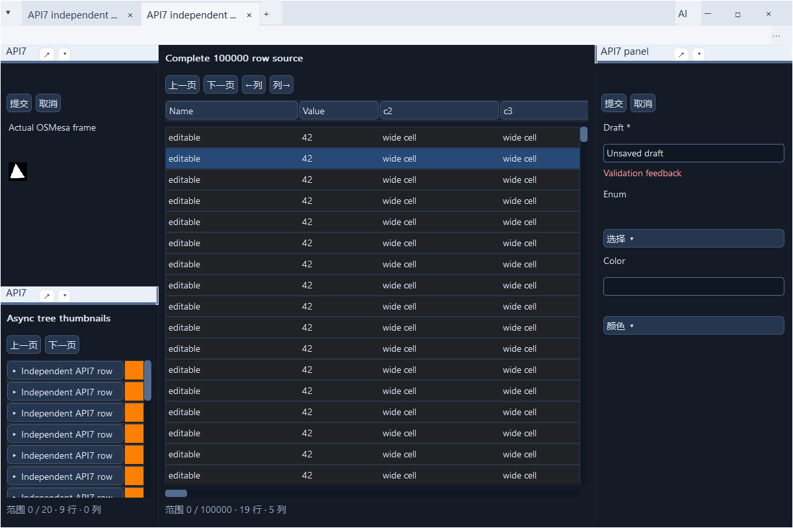

# 框架自有界面视觉验收

2026-10-06，接手HEAD7e87f55eaa09cab46f9f5add359c344118df6a98，分支codex/menus-offscreen。四个未提交的AI默认收起改动（main.c、browser_host.c、web_host_frontend.c、standalone-host.md）审查后保留，原始inherited-ai.patch与本轮复验另存。已有API5/6/7、菜单和浏览器外壳不重复开发。

本地单元485ef0d（视觉/AI/用例）、f733bcce（现有CI分类）、0b306e609e2a84914cb9d55abe1385d647b5db26（捕获及参数反馈修复）。核心完整矩阵源码是0b306e6；随后c5df8c062709ef088695a36f0272a843fb30fa5d收紧工具密度，7d81b8f513ba414c6ed45f3f2cdf43acbe4cdd12保留非法参数草稿并禁用旧值执行，01c87801aa86d70759c45e333af7ecc6e31699fc保持参数预算及JSON数值保真。每个宿主模板/测试单元分别通过14项相关回归；最终运行源码01c8780。其后文档和归档不变运行代码。没有推送、远程工作流、稳定标签、代理或新会话。

## 1. 实现及兼容

覆盖清单、视觉数值、原生边界见[视觉规范](../visual-design.md)。统一中性浅深主题、字体/box-sizing、标签/工具/菜单/窗口控制、标题/分隔、共同树/表格/字段/颜色/枚举/完整范围滚动、空/加载/图片失败、Web浮动标题。轻量修复边框节点无背景时使用空刷，补祖先hover/active和焦点矩形；WebView2用同一共同模板并保留浏览器字体/编辑差异。

AI启动默认收起，手动状态不随resize/实例切换改变；普通视图显示目标、可读操作、基本参数、执行状态/结果，高级区保留事务/快照、schema/原JSON/日志。基本参数复用原JSON/allowlist/validator，保留未知值，非法数字草稿不写入且不因其他字段回填丢失，执行按钮保持禁用；布尔反馈即时更新。合并参数超过原4095 UTF-8字节预算时不投递或执行旧JSON；基本整数要求safe integer，原JSON数值token无法无损回填时保留原字节并使用高级路径。嵌套/枚举等复杂schema有明确高级入口，没有第二套业务命令或模型服务。

API7/SDK0.7/标准7、ABI1/包格式1保持，公共include及结构/枚举/size合同未变。旧调用方无需为外观重编译，部署宿主/DLL使用匹配版本。未修改请求方应用、PERF-001、冻结SDK或原包；未提高节点/JS/行缓存/图片/投递、像素或句柄/GDI/USER门槛。应用自有HTML/原生/GL仍管理自身主题，原生系统控件不能承诺与共同模板逐像素一致。

## 2. 环境、依赖和身份

Windows x64 10.0.26300.0、Session1交互桌面；交付前environment-release.json实读单2560×1440/96DPI显示器、非管理员。早期高DPI窗口受当时最大跟踪尺寸夹紧，逐次环境身份未保存全部桌面尺寸，不声称整轮桌面分辨率一致；核心前后外窗/组件尺寸与程序DPI一致。MSVC19.50/VC14.50.35717、Windows SDK10.0.26100.0、C11/W4/WX、CMake/CTest4.2.3-msvc3、Ninja。固定Lexbor7fb22cf5664a331d7c24b113489e566767c9c25a、QuickJS-NG2f0aa72a6b09cf69ff06399bcf9f4c083ac1a278；WebView2 SDK1.0.4129.50，实际Runtime154.0.4258.53。OSMesa24.3.4/llvmpipe/LLVM19.1.7固定DLL SHA256 c633b820bba8ec0dcb05466505e3c246e4c4028eaec7caf1054e707c8eb3ca1f。正常WGL为Intel UHD770 3.3 compatibility，未据renderer推断硬件类别。MDL2使用系统字体，无新依赖。

build/ci-webview2包含实际Runtime、显式OSMesa和六个只读原包；build/ci-native及build/ci-light另复验关闭后端的构建/链接。final/native/light-identity.json记录精确commit、OS、Runtime、全部实际EXE/DLL/.uapp SHA256，*-plan.json保存每项命令/参数，JUnit、原LastTest、退出码和编译日志对应保存。最终运行时仅文档修改未提交，完整矩阵产品/测试源码等于0b306e6；其后三轮工具/参数相关运行分别是各单元提交前的两文件修改，随后提交c5df8c0、7d81b8f、01c8780；原identity如实保留dirty状态，不改为clean。最终截图另记录release-snapshot-binaries.json中的已提交01c8780与实际DLL/应用包哈希。

[原始证据包](visual-ui-evidence.zip)归档459项原字节，包括失败、修复、最终结果、脚本、源码及78组BMP/PNG像素校验；[归档身份](visual-ui-evidence-manifest.json)记录4,995,954字节与SHA256 544782ed7247b8b545185113456617a0783c824c2a1b118e69077c21588c21e4，包内sha256.json逐项校验。本机结果没有GitHub run ID，不冒充托管CI。现有native/light/webview2/osmesa矩阵只新增正确的视觉用例分类，没有授权远程触发。复验命令见[构建说明](../build-and-validation.md#框架视觉复验)。

## 3. 测试与失败

| 运行 | 结果 |
| --- | --- |
| 收起AI接手补验 | frontend通过；browser右边缘缩放失败，24次重开资源平稳；保留inherited-ai日志/原patch |
| 首轮视觉红例 | 两后端浅色、高级区/窄窗共8失败；原截图保留 |
| 第一版像素/专项 | 截图发现边框单元格黑底，新增白像素断言失败；14项专项12通过/2失败（右边缘、事务不可见） |
| 修正后14项 | 14/14，70.87秒；此时尚未执行后续完整捕获/参数检查，不冒充最终全绿 |
| f733bcc完整矩阵 | 62PASS/1FAIL/1物理SKIP，365.98秒；ui_light_web_parity按钮点击失败 |
| 捕获/参数修复专项 | 7/7，15.72秒，含两后端视觉、原light parity、完整范围滚动、browser及frontend |
| 0b306e6完整配置 | 63PASS/1物理SKIP、0失败，376.85秒；实际Runtime/OSMesa/Intel WGL |
| 原生/Light初跑 | 19PASS/2FAIL/1SKIP（13.32秒）及33PASS/9FAIL/1SKIP（67.96秒），Mesa默认D3D12崩溃 |
| 同二进制显式llvmpipe | 原生21PASS/1物理SKIP，4.94秒；Light42PASS/1物理SKIP，47.92秒 |
| 最后工具密度单元 | 原240上限检查通过，不记失败；新增短项实际240px红例，最终c5df8c0相关14/14，68.41秒 |
| 非法草稿单元 | 保留4项旧值执行/草稿丢失红例；7d81b8f相关14/14，68.14秒 |
| 参数边界单元 | 合并预算/大整数3项红例；01c8780相关14/14，67.76秒 |
| 最终截图驱动 | Light、实际WebView2、EDA助手/GL各0失败，01c8780；BMP/PNG像素一致 |
| 文档检查 | 18份链接/代码围栏/API7版本及每次启动收起检查通过；初始短语匹配错误的脚本/失败日志保留 |
| CI分区/兼容审计 | 01c8780最后检查PASS（ci-classification-release、compatibility-release）；7e87f55旧helper重现新Runtime用例误分类；SDK1–6/六原包哈希PASS |

右边缘缺陷在AI收起后稳定复现两次：实际命中应用子窗口、右1280→1280，原断言保留。NCCALCSIZE普通窗口只移除top标题，保留系统侧/底缩放框后实际resize通过；原生与GL内容尺寸/对象继续原生命周期。事务按钮最初在schema/参数长内容下方不可见，移动到折叠高级区顶部，保留原begin/commit/undo断言。

原生/Light目录中的四个Mesa24.3.4 DLL与固定提供方SHA256逐字节一致。直接CTest初跑没有设置既有CI要求的GALLIUM_DRIVER，实际renderer为D3D12(Intel UHD770)，Windows事件1000将崩溃定位到libgallium_wgl.dll偏移0xde41aa（c0000005/041d）。OpenGL源码与基线没有diff；不删除/替换DLL，按既有CI显式llvmpipe运行相同二进制，两配置通过，故不是产品修复，D3D12组合仍有未解决崩溃。native/light原失败、事件、部署hash和software两次身份均保留；不把软件GL成功冒充D3D12通过。

最后真实截图显示工具标题估算偏宽。原声明240上限用例通过，排除了“flex超过声明宽度”的初始判断；新短标题紧凑用例实际240失败。按Latin/CJK单位估算尺寸，保留40紧凑图标、70–240文字范围、分组及原溢出预算，并对齐20像素标签/图标。本次仅宿主模板/测试变化，核心完整结果仍准确绑定0b306e6，最终工具单元另执行相关14项，不伪称重新运行所有配置。

最后基本参数红例进一步复现非法数字草稿被另一字段更新回填、旧有效JSON仍可执行；invalid-parameter-red保存4项失败。无效草稿保留及统一invoke禁用后14项通过。parameter-boundary-red保存合并参数超过预算仍执行旧值、未知大整数进入有损基本输入的3项失败；按原4095 UTF-8预算检查、拒绝不安全基本整数并将无法roundtrip的数值JSON转到原高级区后14项通过。非规范小数/指数写法或数字成员顺序变化也可能转到高级区，属于保真边界，不宣称完整schema表单支持。高级编辑保留原C validator及执行合同，未替换业务校验。

完整矩阵另稳定复现light parity：文本拖动未释放捕获，按钮再SetCapture同一个HWND产生WM_CAPTURECHANGED，清掉pressed，命令没有执行。诊断打印消息0x215及same-HWND；仅跳过重复获取，真实失去捕获仍取消，诊断代码已移除。parity-repro、parity-diagnostic和full-parity-red保留原失败，未减少点击次数断言。

新基本参数测试最初只修改C状态而未刷新视图，产生两项测试初始化失败；capture-fixed日志保留。修正初始化后未知JSON值正确保留，另外的布尔“是/否”即时反馈断言真实失败。params-boolean-red保存；本地更新UI模型后通过。params-setup-diagnostic-notes说明初始诊断路径曾重复使用，不能冒充原日志；capture-fixed原日志/XML未覆盖。截图辅助驱动最初错用“成功”断言（实际文案“操作完成”），保留失败源/日志，改成真实文案后0失败；产品/应用DLL未因此改动。早期编译/RC路径和测试枚举错误也保留，不计功能通过。

ui_visual_ui实际加载未修改的api7_fixture.uapp，组合十万行/超过2^53稳定ID、表单草稿/错误、枚举/连续RGBA、异步树图片、实际OSMesa frame、双实例、收起/展开/目标保留、窄窗标签及96/144/192程序DPI。renderer像素检查白背景/pressed/取消；其他原用例覆盖列表/空单项/末项/换源/迟到、排序/多选/编辑、布局格式1/2/标签/浮动/分隔、modal/焦点、一次命令、REFUSE/WAIT、初始化失败/清理/卸载及旧非MSAA。独立DLL只算框架集成。

历史Runtime资源波动和共享桌面输入失败仍归[稳定性记录](runtime-stability-validation.md)，本轮通过不主张永久根治，不强杀Runtime、删除用户数据或加延时/阈值。

## 4. 真实前后截图

核心对照使用相同api7_fixture应用源码、相同十万行数据/选中ID/草稿及错误、1200×800物理外窗/96DPI和对应浅/深主题；表格捕获480×320逻辑/96DPI，两后端分别实际执行。应用源码未改，实际DLL/UAPP通过加载运行。基线为7e87f55加四文件收起AI改动和新截图驱动；基线未保存产物hash，不能声称与最终DLL字节完全相同。最终截图绑定release-snapshot-binaries.json，01c8780运行库hash2a0612cf3dbf8962b5adf479e1c193b32d229b1151fb7bfc14f80c4af39b7f56，应用api7_fixture.uapp hash ec45661fc6f24f1d60216d7ca430d652d97e73874d74fa55a937f3d9a90de98f。

PrintWindow保存实际宿主/原生子窗口；共同组件由公共C RGBA捕获，真实WebView2等待PENDING完成；BMP→PNG仅无损转换，RGB逐像素一致，尺寸/像素hash见screenshot-pixels.json。没有生成图、静态HTML或替代GL。窗口框来自系统，深色截图中的系统边缘仍可能跟随Windows主题；不冒充DWM桌面交换验收。

修改前轻量完整应用：

修改后同条件：

[前深色](visual-ui-before-dark.png)、[后深色](visual-ui-after-dark.png)、[WebView2前表格](visual-ui-before-webview2.png)、[WebView2后表格](visual-ui-after-webview2.png)、[RGBA/透明度](visual-ui-after-color.png)、[真实EDA助手普通视图](visual-ui-after-assistant.png)、[真实GL内容](visual-ui-after-gl.png)、[三级菜单](visual-ui-after-menu.png)。

其余原图在证据包，包括空/多标签/同应用双实例、浅深表单/树、枚举、两后端表格96/144/192及宿主程序DPI/窄窗。程序高DPI请求会受本机最大窗口跟踪尺寸夹紧，PNG清单给出实际像素尺寸；窄窗前480px、后320px是不同的访问用例，不能作为同尺寸外观对照。辅助截图展示原生应用内容边界，未修改旧业务控件样式。

## 5. 最后条件与交付边界

最后在01c8780实际调用当前服务脚本并要求RequireNoLogin，第11行非管理员检查退出1，输出目录不存在，未创建服务/注销用户/修改既有服务；session0-release-permission.log/exit与environment-release.json保存当前门槛，之前两次权限日志继续保留。完整矩阵0b306e6中的Session1实际应用DLL/OSMesa200周期、HWND0与资源回收通过；随后仅宿主模板/测试变化，未另跑200周期。当前源码Session0尚未完成，严格整机无登录、物理中文IME/不同DPI多屏/屏幕边缘Snap与DWM/长期人工继续待验；Session1 OSMesa不替代Session0，历史78c24cb成功也不继承。用户已确认无严格无登录服务runner，不注销用户或修改既有服务。业务试点没有指定应用和修改授权，不修改请求方应用；没有OSMesa实测性能瓶颈和硬件GL需求，不扩展硬件无窗口方案。

本轮是本地实现/回归/截图/文档交付，不是托管CI、所有目标环境或真实业务完整验收。

原API1–6二进制来源和SHA256按[API7保全表](api7-validation.md#5-兼容依赖和复现)，本轮compatibility.log再次核对原字节，full/final计划实际运行旧包；冻结SDK重编译调用方与原二进制两类证据分别保留。旧API7调用方使用未改动公共头文件/原注册合同运行，当前应用包无需为内部外观升级API。
